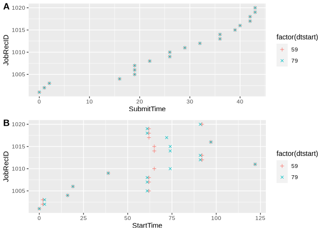
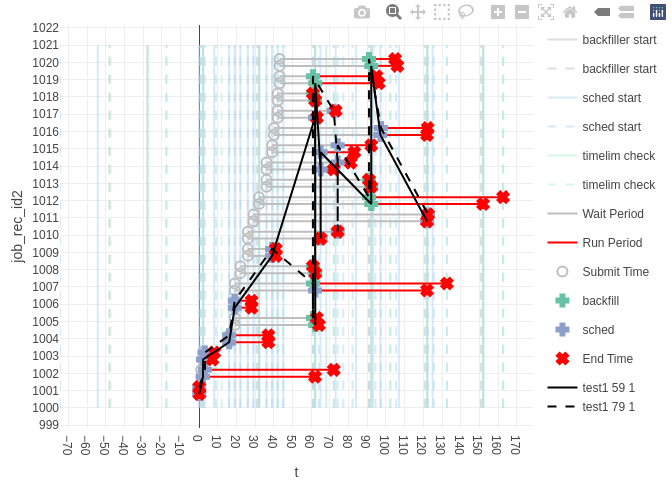

Slurm Simulator: Micro Cluster Tutorial
================
<nikolays@buffalo.edu>
28 May, 2024

- [Slurm Simulator: Micro Cluster
  Tutorial](#slurm-simulator-micro-cluster-tutorial)
  - [Overview](#overview)
  - [Micro-Cluster Description](#micro-cluster-description)
  - [Slurm Simulation Configuration](#slurm-simulation-configuration)
    - [Adopting the Slurm Configuration for
      Simulation](#adopting-the-slurm-configuration-for-simulation)
      - [Changes in `slurm.conf`](#changes-in-slurmconf)
      - [Changes in `slurmdbd.conf`](#changes-in-slurmdbdconf)
      - [Changes to `gres.conf`](#changes-to-gresconf)
      - [Changes to `topology.conf`](#changes-to-topologyconf)
    - [Set up Users, Accounts, QoS
      Specs](#set-up-users-accounts-qos-specs)
      - [System User names and Groups -
        `users.sim`](#system-user-names-and-groups---userssim)
      - [Adding Users, Accounts and QoS -
        `sacctmgr.script`](#adding-users-accounts-and-qos---sacctmgrscript)
  - [Simulation Parameters](#simulation-parameters)
  - [Workload Specification (events file, a.k.a. job
    traces)](#workload-specification-events-file-aka-job-traces)
  - [Run First Simulations](#run-first-simulations)
  - [Read Results](#read-results)
  - [Make Events Plot](#make-events-plot)
- [Run and Analyse Multiple Independent
  Simulations](#run-and-analyse-multiple-independent-simulations)

# Slurm Simulator: Micro Cluster Tutorial

``` bash
# Check that MySQL Server is up
ps -Af | grep mariadbd 
```

    ## mysql      151    23  0 18:45 pts/0    00:00:01 /usr/sbin/mariadbd --basedir=/usr --datadir=/var/lib/mysql --plugin-dir=/usr/lib/mysql/plugin --user=mysql --skip-log-error --pid-file=/run/mysqld/mysqld.pid --socket=/run/mysqld/mysqld.sock
    ## slurm    29089 27777  0 21:14 ?        00:00:00 sh -c 'bash'  -c '# Check that MySQL Server is up ps -Af | grep mariadbd ' 2>&1
    ## slurm    29090 29089  0 21:14 ?        00:00:00 bash -c # Check that MySQL Server is up ps -Af | grep mariadbd 
    ## slurm    29092 29090  0 21:14 ?        00:00:00 grep mariadbd

## Overview

This tutorial will teach you how to run a Slurm Simulator using an
example of a small 10-node Micro-Cluster.

The tutorial will walk you through the Slurm simulation configuration.

You will run two simulations with identical workloads but different
timing between the start-up and first job to investigate scheduling
stochasticity.

Finally, you’ll run ten independent simulations with the same workload
and calculate statistics other than runs.

The files needed for this tutorial are located at
`slurm_sim_tools/tutorials/micro_cluster`.

## Micro-Cluster Description

In this tutorial small model cluster, named Micro-Cluster, will be
simulated. Micro-Cluster is created to test various aspects of the slurm
simulator usage. It consists of 10 compute nodes (see Table below).
There are two types of general compute nodes with different CPU types to
test features request (constrains), one GPU node to test GRes and one
big memory node to test proper allocation of jobs with large memory
requests.

| Node Type       | Node Name | Number of Cores | CPU Type | Memory Size | Number of GPUs |
|-----------------|-----------|-----------------|----------|-------------|----------------|
| General Compute | n\[1-4\]  | 12              | CPU-N    | 48GiB       | \-             |
| General Compute | m\[1-4\]  | 12              | CPU-M    | 48GiB       | \-             |
| GPU node        | g1        | 12              | CPU-G    | 48GiB       | 2              |
| Big memory      | b1        | 12              | CPU-G    | 512GiB      | \-             |

Micro-Cluster compute nodes description

The nodes are connected as follows:

    Top Switch
     ├─IBN Switch
     │  ├─Node n1
     │  ├─Node n2
     │  ├─Node n3
     │  └─Node n4
     ├─IBM Switch
     │  ├─Node m1
     │  ├─Node m2
     │  ├─Node m3
     │  └─Node m4
     └─IBG Switch
        ├─Node g1
       `└─Node b1

## Slurm Simulation Configuration

The UB Slurm Simulator is made from Slurm source code and so it shares
many configurations with actual Slurm installation. In addition, you
also need to specify that simulated users will submit to the simulated
cluster and some simulation parameters.

In order to run Slurm simulation you need:

1.  Adopt the Slurm configuration (`slurm.conf` and friends) for
    simulation
    - Some options are not supported and files, typically used in slurm
      need to be renamed and point to user space.
2.  Set-up users and accounts: create `sacctmgr.script` and `user.sim`.
3.  Specify simulation parameters
    - `sim.conf` some of parameters needed to be reset at run-time
4.  Create events file with workload specification (a.k.a. job-traces or
    events-list).

``` bash
ls etc
```

    ## gres.conf
    ## sacctmgr.script
    ## sim.conf
    ## slurm.cert
    ## slurm.conf
    ## slurmdbd.conf
    ## slurm.key
    ## topology.conf
    ## users.sim

### Adopting the Slurm Configuration for Simulation

The simulator is built from Slurm code and uses regular Slurm
configuration.

In the `etc` directory, you can find several familiar Slurm
configuration files: `slurm.conf`, `topology.conf`, `gres.conf` and
`slurmdbd.conf`.

When you start from the actual cluster configuration, some modifications
are needed to point to different file system locations and disable some
features which the simulator cannot work with.

The files in this tutorial are already modified to be executed in
simulator mode. In the following sub-section, we will list those
changes.

#### Changes in `slurm.conf`

``` ini
# (optional) Different cluster name might be useful
ClusterName=micro

# Authentication is turned off
AuthType=auth/none

# This user will be used to run slurm simulator
SlurmUser=slurm
# (not needed) UB Slurm simulator does not use slurmd
SlurmdUser=root
# (not needed) This parameter is for Virtual Clusters (not used in Simulator)
SlurmdParameters=config_overrides

# Change Slurm control daemon address to localhost
ControlMachine=localhost
ControlAddr=localhost
# Change Slurm Database daemon address to localhost
AccountingStorageHost=localhost

# Change file location
JobCredentialPrivateKey=/home/slurm/work/micro_cluster/etc/slurm.key
JobCredentialPublicCertificate=/home/slurm/work/micro_cluster/etc/slurm.cert
SlurmSchedLogFile=/home/slurm/work/micro_cluster/log/sched.log
SlurmctldLogFile=/home/slurm/work/micro_cluster/log/slurmctld.log
SlurmdLogFile=/home/slurm/work/micro_cluster/log/slurmd.log
SlurmdSpoolDir=/home/slurm/work/micro_cluster/var/spool
StateSaveLocation=/home/slurm/work/micro_cluster/var/state
JobCompLoc=/home/slurm/work/micro_cluster/log/jobcomp.log

# Have to set it as simulator uses front-end mode
FrontEndName=localhost
```

#### Changes in `slurmdbd.conf`

``` ini
# Change Slurm Database daemon address to localhost
DbdHost=localhost
# Authentication is turned off
AuthType=auth/none

# Change file location
PidFile=/home/slurm/work/micro_cluster/var/slurmdbd.pid
LogFile=/home/slurm/work/micro_cluster/log/slurmdbd.log

# Change mysql server address to localhost and accounts
StorageHost=localhost
StorageUser=slurm
StoragePass=slurm
# This user will be used to run slurm dbd
SlurmUser=jovyan
# (optional) database name in mysql to use
StorageLoc=slurmdb_micro
```

#### Changes to `gres.conf`

``` ini
# There is no actual hardware everything should be specified manually
AutoDetect=off
```

#### Changes to `topology.conf`

It should be fine as is.

### Set up Users, Accounts, QoS Specs

Usually system administrator will create user and accounts on the HPC
resource on per need base. In simulator, we need to create a file with
simulated system usernames and a script for Slurm `sacctmgr` utility to
initiate cluster QoS-es, users and accounts.

#### System User names and Groups - `users.sim`

`users.sim` fount in `etc` folder specify simulated system users and
group names and ids. The file format is one line per user with colon
(`:`) separated four fields:

    <user named>:<user id>:<group name>:<group id>

The used `users.sim` file is as follows:

    admin:1000:admin:1000
    user1:1001:group1:1001
    user2:1002:group2:1002
    user3:1003:group3:1003
    user4:1004:group2:1002
    user5:1005:group1:1001

#### Adding Users, Accounts and QoS - `sacctmgr.script`

`sacctmgr.script` is a script which will be executed by `sacctmgr`
before the simulation. It adds slurm users, accounts, QoS and all other
things sys-admins will do with sacctmgr.

Below is a listing of used `sacctmgr.script`:

``` shell
# add/modify QOS
modify QOS set normal Priority=0
add QOS Name=supporters Priority=100
# add cluster
add cluster Name=micro Fairshare=1 QOS=normal,supporters
# add accounts
add account name=account0 Fairshare=100
add account name=account1 Fairshare=100
add account name=account2 Fairshare=100
# add admin
add user name=admin DefaultAccount=account0 MaxSubmitJobs=1000 AdminLevel=Administrator
# add users
add user name=user1 DefaultAccount=account1 MaxSubmitJobs=1000
add user name=user2 DefaultAccount=account1 MaxSubmitJobs=1000
add user name=user3 DefaultAccount=account1 MaxSubmitJobs=1000
add user name=user4 DefaultAccount=account2 MaxSubmitJobs=1000
add user name=user5 DefaultAccount=account2 MaxSubmitJobs=1000
# add users to qos level
modify user set qoslevel="normal,supporters"

# check results
list associations format=Account,Cluster,User,Fairshare tree withd
```

The script starts with modification of `normal` QoS and adding new QoS,
`priority`, with higher priority factor.

Then, we add Slurm users and accounts. Slurm user names should match the
system user names we specified at `users.sim`.

Here we have 5 users (user1, user2, user3, user4, user5) grouped into 2
accounts (account1, account2). There is also an admin user with an
associated account. We allowed all users to use both QoS-es.

Finally, we printed created association (relationship between users and
accounts)

## Simulation Parameters

In the etc directory, you can find several configuration files:

``` ini
# Simulation Configuration

## Unix time stamp for the simulated start time
TimeStart = 1641013200.0
## Unix time stamp for the simulated stop time, 0 - run till all jobs are finished
TimeStop = 0
## Time between simulator start and first job execution (can be overwritten by `slurmsim run_sim`)
SecondsBeforeFirstJob = 126
## CPU clock scaling
ClockScaling = 1.0
## Events File (can be overwritten by `slurmsim run_sim`)
EventsFile = /home/slurm/work/micro_cluster/job_traces/jobs500_shrinked.events
## Seconds after all events are done, -1 keep spinning time_after_all_events_done.
TimeAfterAllEventsDone = 10

## Some time delays to mimic start-up times of actual Slurm controller
FirstJobDelay = -0.32
CompJobDelay = 0.000
TimeLimitDelay = 0.000
```

Some of these parameters can be overwritten from the command line

## Workload Specification (events file, a.k.a. job traces)

In `job_traces` you can find many files finished with `.events`
extension, these are events list file which used to specify users
activities on simulated cluster.

Here is the listing of `small.events`:

``` bash
-dt 0 -e submit_batch_job | -J jobid_1001 -sim-walltime 0 --uid=user5 -t 00:01:00 -n 12 --ntasks-per-node=12 -A account2 -p normal -q normal pseudo.job
-dt 1 -e submit_batch_job | -J jobid_1002 -sim-walltime -1 --uid=user1 -t 00:01:00 -n 1 --ntasks-per-node=1 -A account1 -p normal -q normal --constraint=CPU-N pseudo.job
-dt 2 -e submit_batch_job | -J jobid_1003 -sim-walltime 5 --uid=user4 -t 00:01:00 -n 1 --ntasks-per-node=1 -A account2 -p normal -q normal --mem=500000 pseudo.job
-dt 16 -e submit_batch_job | -J jobid_1004 -sim-walltime 21 --uid=user3 -t 00:01:00 -n 24 --ntasks-per-node=12 -A account1 -p normal -q normal pseudo.job
-dt 19 -e submit_batch_job | -J jobid_1005 -sim-walltime 2 --uid=user5 -t 00:01:00 -n 12 --ntasks-per-node=12 -A account2 -p normal -q normal --mem=500000 pseudo.job
-dt 19 -e submit_batch_job | -J jobid_1006 -sim-walltime 9 --uid=user3 -t 00:01:00 -n 48 --ntasks-per-node=12 -A account1 -p normal -q normal pseudo.job
-dt 19 -e submit_batch_job | -J jobid_1007 -sim-walltime -1 --uid=user4 -t 00:01:00 -n 24 --ntasks-per-node=12 -A account2 -p normal -q normal --constraint=CPU-M pseudo.job
-dt 22 -e submit_batch_job | -J jobid_1008 -sim-walltime 0 --uid=user4 -t 00:01:00 -n 12 --ntasks-per-node=12 -A account2 -p normal -q normal --constraint=CPU-M pseudo.job
-dt 26 -e submit_batch_job | -J jobid_1009 -sim-walltime 2 --uid=user1 -t 00:01:00 -n 96 --ntasks-per-node=12 -A account1 -p normal -q normal pseudo.job
-dt 26 -e submit_batch_job | -J jobid_1010 -sim-walltime 0 --uid=user5 -t 00:01:00 -n 12 --ntasks-per-node=12 -A account2 -p normal -q normal --constraint=CPU-N pseudo.job
-dt 29 -e submit_batch_job | -J jobid_1011 -sim-walltime 0 --uid=user4 -t 00:01:00 -n 1 --ntasks-per-node=1 -A account2 -p normal -q normal --gres=gpu:1 pseudo.job
-dt 32 -e submit_batch_job | -J jobid_1012 -sim-walltime -1 --uid=user5 -t 00:01:00 -n 1 --ntasks-per-node=1 -A account2 -p normal -q normal pseudo.job
-dt 36 -e submit_batch_job | -J jobid_1013 -sim-walltime 0 --uid=user2 -t 00:01:00 -n 1 --ntasks-per-node=1 -A account1 -p normal -q normal --mem=500000 pseudo.job
-dt 36 -e submit_batch_job | -J jobid_1014 -sim-walltime 7 --uid=user5 -t 00:01:00 -n 24 --ntasks-per-node=12 -A account2 -p normal -q normal --constraint=CPU-N pseudo.job
-dt 39 -e submit_batch_job | -J jobid_1015 -sim-walltime 18 --uid=user2 -t 00:01:00 -n 6 --ntasks-per-node=6 -A account1 -p normal -q normal pseudo.job
-dt 40 -e submit_batch_job | -J jobid_1016 -sim-walltime 25 --uid=user1 -t 00:01:00 -n 2 --ntasks-per-node=2 -A account1 -p normal -q normal --gres=gpu:2 pseudo.job
-dt 42 -e submit_batch_job | -J jobid_1017 -sim-walltime 1 --uid=user1 -t 00:01:00 -n 48 --ntasks-per-node=12 -A account1 -p normal -q normal --constraint=CPU-N pseudo.job
-dt 42 -e submit_batch_job | -J jobid_1018 -sim-walltime 0 --uid=user3 -t 00:01:00 -n 12 --ntasks-per-node=12 -A account1 -p normal -q normal pseudo.job
-dt 43 -e submit_batch_job | -J jobid_1019 -sim-walltime 34 --uid=user4 -t 00:01:00 -n 12 --ntasks-per-node=12 -A account2 -p normal -q normal --gres=gpu:2 pseudo.job
-dt 43 -e submit_batch_job | -J jobid_1020 -sim-walltime 14 --uid=user1 -t 00:01:00 -n 1 --ntasks-per-node=1 -A account1 -p normal -q normal --constraint=CPU-N pseudo.job
```

Each line corresponds to a single event, the arguments till the first
pipe symbol (`|`) correspond to event time and event type, and arguments
after the pipe symbol (`|`) correspond to event parameters. For the
user’s job submission format, the arguments are just like you submit to
the `sbatch` command (it is processed by the same function), there are
some additional arguments and some normal `sbatch` arguments which have
to follow certain format. Bellow is the format:

    -dt <time to submit since the start of slurm controller> -e submit_batch_job | -J jobid_<jobid> -sim-walltime <walltime in seconds> --uid=<user> -t <requested time> -A <account> <Other Normal Slurm Arguments> pseudo.job

Here is a list of some often used `sbatch` arguments and
simulator-augmented

- `-J jobid_<jobid>`: `-J` is a normal Slurm argument to specify
  jobname, we use it for results processing automation, so give all jobs
  names like `jobid_<jobid>`, where `<jobid>` is numeric job-id.
  Some-times your simulation can be misconfigured and automatically
  assigned numeric `job-id` can be misalligned.
- `-sim-walltime <walltime in seconds>`: specify walltime for job to
  run. Value `0` means job have to be killed by Slurm due to running
  outside of time-limit.
- `--uid=<user>`: it is a normal Slurm argument but we is it to specify
  which user submit job
- `-t <requested time>`: it is a normal Slurm argument for time request
- `-A <account>`: it is a normal Slurm argument for specifying which
  account to use
- `<Other normal Slurm arguments>`:
  - `-n <nomber of noded>`
  - `--ntasks-per-node=<ntasks-per-node>`
  - `--gres=<gres request>`
  - `--constraint=<features request>`
  - `--mem=<memory request>`
  - Try other `sbatch` arguments, they might work as well
- `pseudo.job`: should finished with script name, this also used in VC

``` bash
pwd
```

    ## /home/slurm/work/micro_cluster

## Run First Simulations

`slurmsim` is a utility for various Slurm simulation tasks. To run the
simulation, we will use the `run_sim` subcommand. Execute following:

``` bash
export CLUS_DIR=$(pwd)
export MACHINE_NAME="slurmsimcont"
export RUN_NAME="test1"
export dtstart=59
export replica=1

slurmsim -v run_sim  -d \
            -e ${CLUS_DIR}/etc \
            -a ${CLUS_DIR}/etc/sacctmgr.script \
            -w ${CLUS_DIR}/workload/small.events \
            -r ${CLUS_DIR}/results/${MACHINE_NAME}/${RUN_NAME}/dtstart_${dtstart}_${replica} \
            -dtstart $dtstart
```

        Logger initialization
        [INFO] Note: NumExpr detected 16 cores but "NUMEXPR_MAX_THREADS" not set, so enforcing safe limit of 8.
        [INFO] NumExpr defaulting to 8 threads.
        [INFO] Read from /home/slurm/work/micro_cluster/job_traces/small.events 20 even ts
        [INFO] slurm.conf: /home/slurm/work/micro_cluster/etc/slurm.conf
        [INFO] slurmdbd: /opt/slurm_sim/sbin/slurmdbd
        [INFO] slurmd: /opt/slurm_sim/sbin/slurmd
        [INFO] slurmctld: /opt/slurm_sim/sbin/slurmctld
        [INFO] dropping db from previous runs
        DROP DATABASE IF EXISTS slurmdb_micro
        [INFO] directory (/home/slurm/work/micro_cluster/log) does not exist, creating it 
        [INFO] deleting previous SlurmdbdPidFile file: /home/slurm/work/micro_cluster/var/slurmdbd.pid
        [INFO] deleting previous StateSaveLocation files from /home/slurm/work/micro_cluster/var/state
        [DEBUG] Set stdout/stderr for slurmctld to /home/slurm/work/micro_cluster/log/slurmctld_stdout.log
        [DEBUG] Set stdout/stderr for slurmdbd to /home/slurm/work/micro_cluster/log/slurmdbd_stdout.log
        [INFO] Launching slurmdbd
        [INFO] Running sacctmgr script from /home/slurm/work/micro_cluster/etc/sacctmgr.script
        sacctmgr: sacctmgr:  Modified qos...
          normal
        sacctmgr:  Adding QOS(s)
          supporters
         Settings
          Description    = supporters
          Priority                 = 100
        sacctmgr: sacctmgr:  Adding Cluster(s)
          Name           = micro
         Setting
          Default Limits:
          Fairshare     = 1
          QOS           = normal,supporters
        sacctmgr: sacctmgr:  Adding Account(s)
          account0
         Settings
          Description     = Account Name
          Organization    = Parent/Account Name
         Associations
          A = account0   C = micro     
         Settings
          Fairshare     = 100
          Parent        = root
        sacctmgr:  Adding Account(s)
          account1
         Settings
          Description     = Account Name
          Organization    = Parent/Account Name
         Associations
          A = account1   C = micro     
         Settings
          Fairshare     = 100
          Parent        = root
        sacctmgr:  Adding Account(s)
          account2
         Settings
          Description     = Account Name
          Organization    = Parent/Account Name
         Associations
          A = account2   C = micro     
         Settings
          Fairshare     = 100
          Parent        = root
        sacctmgr: sacctmgr:  Adding User(s)
          admin
         Settings =
          Default Account = account0
          Admin Level     = Administrator
         Associations =
          U = admin     A = account0   C = micro     
         Non Default Settings
          MaxSubmitJobs = 1000
        sacctmgr: sacctmgr:  Adding User(s)
          user1
         Settings =
          Default Account = account1
         Associations =
          U = user1     A = account1   C = micro     
         Non Default Settings
          MaxSubmitJobs = 1000
        sacctmgr:  Adding User(s)
          user2
         Settings =
          Default Account = account1
         Associations =
          U = user2     A = account1   C = micro     
         Non Default Settings
          MaxSubmitJobs = 1000
        sacctmgr:  Adding User(s)
          user3
         Settings =
          Default Account = account1
         Associations =
          U = user3     A = account1   C = micro     
         Non Default Settings
          MaxSubmitJobs = 1000
        sacctmgr:  Adding User(s)
          user4
         Settings =
          Default Account = account2
         Associations =
          U = user4     A = account2   C = micro     
         Non Default Settings
          MaxSubmitJobs = 1000
        sacctmgr:  Adding User(s)
          user5
         Settings =
          Default Account = account2
         Associations =
          U = user5     A = account2   C = micro     
         Non Default Settings
          MaxSubmitJobs = 1000
        sacctmgr: sacctmgr:  Modified user associations...
          C = micro      A = account2             U = user5    
          C = micro      A = account2             U = user4    
          C = micro      A = account1             U = user3    
          C = micro      A = account1             U = user2    
          C = micro      A = account1             U = user1    
          C = micro      A = account0             U = admin    
          C = micro      A = root                 U = root     
        sacctmgr: sacctmgr: sacctmgr: Account                 Cluster       User     Share 
        -------------------- ---------- ---------- --------- 
        root                      micro                    1 
         root                     micro       root         1 
         account0                 micro                  100 
          account0                micro      admin         1 
         account1                 micro                  100 
          account1                micro      user1         1 
          account1                micro      user2         1 
          account1                micro      user3         1 
         account2                 micro                  100 
          account2                micro      user4         1 
          account2                micro      user5         1 
        sacctmgr: 
        [INFO] Launching slurmctld
        ['/opt/slurm_sim/sbin/slurmctld', '-e', '/home/slurm/work/micro_cluster/job_traces/small.events', '-dtstart', '59']
        [INFO] Current time 1710513133.6579173
        [INFO] slurmdbd_create_time=1710513112.42
        [INFO] slurmctld_create_time=1710513128.36
        [INFO] slurmd_create_time=1710513127.36
        [INFO] Starting job submittion
        [INFO] Monitoring slurmctld until completion
        [INFO] All jobs submitted wrapping up
        [INFO] slurmctld took 30.056071043014526 seconds to run.
        first_line [2022-01-01T05:00:15.938834] error: Unable to open pidfile `/var/run/slurmctld.pid': Permission denied
         2022-01-01 05:00:15.938834 2022-01-01 05:00:15.938834
        last_line [2022-01-01T05:03:57.912788] All done.
         2022-01-01 05:03:57.912788 2022-01-01 05:03:57.912788
        [INFO] Copying results to :/home/slurm/work/micro_cluster/results/slurmsimcont/test1/dtstart_59_1
        [INFO] copying resulting file /home/slurm/work/micro_cluster/log/jobcomp.log to /home/slurm/work/micro_cluster/results/slurmsimcont/test1/dtstart_59_1
        [INFO] copying resulting file /home/slurm/work/micro_cluster/log/slurmctld.log to /home/slurm/work/micro_cluster/results/slurmsimcont/test1/dtstart_59_1
        [INFO] copying resulting file /home/slurm/work/micro_cluster/log/sched.log to /home/slurm/work/micro_cluster/results/slurmsimcont/test1/dtstart_59_1
        [DEBUG] Submit time for first job: 2022-01-01 05:01:14.315371
        [INFO] copying resulting file /home/slurm/work/micro_cluster/log/slurmctld_stdout.log to /home/slurm/work/micro_cluster/results/slurmsimcont/test1/dtstart_59_1
        [INFO] copying resulting file /home/slurm/work/micro_cluster/log/slurmdbd_stdout.log to /home/slurm/work/micro_cluster/results/slurmsimcont/test1/dtstart_59_1
        [INFO] Simulated time: 0:03:41.973954
        [INFO] Real time: 0:00:30.056383
        [INFO] Acceleration: 7.385252
        [INFO] Done

While it is running, we can take a look at specified arguments. First,
we started with setting some bash variables, which will be convenient
later when we automate runs for multiple simulations. We will go through
all of them and describe what it is and why we are doing it in this way.

``` bash
export CLUS_DIR=$(pwd)
```

It is convenient to specify pathways relative to our cluster simulation
directory:

``` bash
export MACHINE_NAME="slurmsimcont"
```

It specify machine name. Just like with real Slurm, the speed of actual
hardware can affect the scheduling, so it is helpful to track which
hardware was used for simulation.

``` bash
export RUN_NAME="test1"
```

`RUN_NAME` is used to label a particular test, for example, control,
high-priority, and so on.

``` bash
export dtstart=59
export replica=1
```

Due to *stochasticity*, we need to have multiple runs. We track them
with `replica` parameter for identical run and `dtstart` for additional
randomization.

`replica` parameter is usually having values like 1,2,3,….

`dtstart` specifies the time delay between the slurm controller start-up
and the first job submission. It is the main randomization mechanism in
Slurm Simulator.

The following arguments were used for `slurmsim` CLI:

- `-v` for extra messages
- `run_sim` command to run single Slurm simulation.
- `-d` remove results from the previous simulation
- `-e` specify the location of slurm `etc.` directory `slurm.conf` and
  friends should be where
- `-a` specify the sacctmgr script to set up accounts, users, qos and
  other things
- `-w` specify workload event file (a.k.a. job traces file)
- `-r` specify results storage directory, we use following format:
  `${CLUS_DIR}/results/${MACHINE_NAME}/${RUN_NAME}/dtstart_${dtstart}_${replica}`
- `-dtstart` specifies the time delay between the slurm controller
  start-up and the first job submission.

The `run_sim` command simplifies the execution of the Slurm Simulator.
It does the following:

1.  With `-d` option, it removes results from the previous simulation
    (clean DB, remove logs, shared memory, etc)
2.  Check the configuration files; some of the options are not supported
    in the Simulator, and some others should be set to a particular
    value. The configuration checking helps to run the simulation. Note
    that not everything is checked.
3.  Create missing directories
4.  Launch `slurmdbd`
5.  Execute `sacctmgr` script
6.  Launch `slurmctld` and start simulation
7.  On finishing `slurmctld` process termenate `slurmdbd`.
8.  Prepocess some outputs so that they can be loaded to R.
9.  Copy all resulting files to the results directory (set with `-r`
    option)

Now take a closer look at the output, you should be able to see the
above steps. At the end you will see something like this:

    [INFO] Simulated time: 0:03:41.973954
    [INFO] Real time: 0:00:30.056383
    [INFO] Acceleration: 7.3852

This informs you on simulated time and the time acceleration.

Take look at result directory:

``` bash
ls results/slurmsimcont/test1/dtstart_59_1
```

    ## jobcomp.log
    ## perf_profile.log
    ## perf_stat.log
    ## sched.log
    ## slurm_acct.out
    ## slurmctld.log
    ## slurmctld_log.csv
    ## slurmctld_stdout.log
    ## slurmdbd_stdout.log

    jobcomp.log
    perf_profile.log
    perf_stat.log
    sched.log
    slurm_acct.out
    slurmctld.log
    slurmctld_log.csv
    slurmctld_stdout.log
    slurmdbd_stdout.log

There are a lot of logs and output files:

- `sched.log` - scheduler log, usually emptyl
- `slurm_acct.out` - `sacct` output at the end of the simulation
- `jobcomp.log` - log from `jobcomp` plug-in
- `slurmctl.log` - log from `slurmctld`
- `slurmctld_stdout.log` - standard output and standard error from
  `slurmctld`, useful if simulation failed
- `slurmdbd_stdout.log` - standard output and standard error from
  `slurmdbd` daemon, useful if simulation failed
- `slurmctld_log.csv` - Slurm controller events generated from
  `slurmctld.log` processing

Lets take a look at `slurm_acct.out`

``` bash
head -n 5 results/slurmsimcont/test1/dtstart_59_1/slurm_acct.out
```

        JobID|JobIDRaw|Cluster|Partition|Account|Group|GID|User|UID|Submit|Eligible|Start|End|Elapsed|ExitCode|State|NNodes|NCPUS|ReqCPUS|ReqMem|ReqTRES|Timelimit|QOS|NodeList|JobName|NTasks
        1001|1001|micro|normal|account2|slurm|1000|user5|1005|2022-01-01T05:01:14|2022-01-01T05:01:14|2022-01-01T05:01:14|2022-01-01T05:01:14|00:00:00|0:0|COMPLETED|1|12|12|33600M|billing=12,cpu=12,mem=33600M,node=1|00:01:00|normal|b1|jobid_1001|
        1002|1002|micro|normal|account1|slurm|1000|user1|1001|2022-01-01T05:01:15|2022-01-01T05:01:15|2022-01-01T05:01:16|2022-01-01T05:02:16|00:01:00|0:0|TIMEOUT|1|1|1|2800M|billing=1,cpu=1,mem=2800M,node=1|00:01:00|normal|n1|jobid_1002|
        1003|1003|micro|normal|account2|slurm|1000|user4|1004|2022-01-01T05:01:16|2022-01-01T05:01:16|2022-01-01T05:01:16|2022-01-01T05:01:21|00:00:05|0:0|COMPLETED|1|1|1|500000M|billing=1,cpu=1,mem=500000M,node=1|00:01:00|normal|b1|jobid_1003|
        1004|1004|micro|normal|account1|slurm|1000|user3|1003|2022-01-01T05:01:30|2022-01-01T05:01:30|2022-01-01T05:01:30|2022-01-01T05:01:51|00:00:21|0:0|COMPLETED|2|24|24|67200M|billing=24,cpu=24,mem=67200M,node=1|00:01:00|normal|b1,g1|jobid_1004|

It contains information on compleded jobs. It will be used for our
analysis.

You also can find two new directories `log` and `var`. Thouse are used
temporary while Slurm Simulator is running all importent files are
eventually copied to results directory.

We rarely would have only one simulation (need statistics), so before
moving to results reading lets make another simulation:

``` bash
export CLUS_DIR=$(pwd)
export MACHINE_NAME="slurmsimcont"
export RUN_NAME="test1"
export dtstart=79
export replica=1

slurmsim -v run_sim  -d \
            -e ${CLUS_DIR}/etc \
            -a ${CLUS_DIR}/etc/sacctmgr.script \
            -w ${CLUS_DIR}/workload/small.events \
            -r ${CLUS_DIR}/results/${MACHINE_NAME}/${RUN_NAME}/dtstart_${dtstart}_${replica} \
            -dtstart $dtstart
```

## Read Results

Because there is a need to handle multiple runs at a same time we have
developed a tools which help us with that. `read_sacct_out_multiple`
will read multiple `slurm_acct.out` from simulations with different
start time and replicas.

``` r
sacct <- read_sacct_out_multiple(
    slurm_mode="test1", # name of simulation
    results_root_dir="results/slurmsimcont/test1",
    dtstart_list=c(59, 79), # start time list
    run_id_list=1, # replicas list
    # sacct_out="slurm_acct.out"  # non-standard name of sacct_out
)
```

    ## Read:  results/slurmsimcont/test1/dtstart_59_1/slurm_acct.out 
    ## Read:  results/slurmsimcont/test1/dtstart_79_1/slurm_acct.out

``` r
sacct
```

<div class="kable-table">

| slurm_mode | dtstart | run_id | JobRecID | SubmitTime | StartTime | EndTime | WallTime | WaitTime | JobId | JobIdRaw |  GID |  UID | NodeCount | NCPUS | ReqCPUS | ReqTRES                              | NodeList             | JobName    | NTasks | Submit              | Eligible            | Start               | End                 |             Elapsed |        Timelimit | Cluster | Partition | Account  | Group | User  | ExitCode | State     | QOS    | ReqMemSize | ReqMemPerNode |   SubmitTS |    StartTS |      EndTS | WaitHours | WallHours | NodeHours | WaitHours4log | WallHours4log |
|:-----------|--------:|-------:|---------:|-----------:|----------:|--------:|---------:|---------:|------:|---------:|-----:|-----:|----------:|------:|--------:|:-------------------------------------|:---------------------|:-----------|:-------|:--------------------|:--------------------|:--------------------|:--------------------|--------------------:|-----------------:|:--------|:----------|:---------|:------|:------|:---------|:----------|:-------|-----------:|:--------------|-----------:|-----------:|-----------:|----------:|----------:|----------:|--------------:|--------------:|
| test1      |      59 |      1 |     1001 |          0 |         0 |       0 |        0 |        0 |  1001 |     1001 | 1000 | 1005 |         1 |    12 |      12 | billing=12,cpu=12,mem=33600M,node=1  | b1                   | jobid_1001 | NA     | 2022-01-01 05:01:14 | 2022-01-01 05:01:14 | 2022-01-01 05:01:14 | 2022-01-01 05:01:14 |                  0s | 60s (~1 minutes) | micro   | normal    | account2 | slurm | user5 | 0:0      | COMPLETED | normal |      33600 | TRUE          | 1641013274 | 1641013274 | 1641013274 | 0.0000000 | 0.0000000 | 0.0000000 |     0.0166667 |     0.0166667 |
| test1      |      59 |      1 |     1002 |          1 |         2 |      62 |       60 |        1 |  1002 |     1002 | 1000 | 1001 |         1 |     1 |       1 | billing=1,cpu=1,mem=2800M,node=1     | n1                   | jobid_1002 | NA     | 2022-01-01 05:01:15 | 2022-01-01 05:01:15 | 2022-01-01 05:01:16 | 2022-01-01 05:02:16 |    60s (~1 minutes) | 60s (~1 minutes) | micro   | normal    | account1 | slurm | user1 | 0:0      | TIMEOUT   | normal |       2800 | TRUE          | 1641013275 | 1641013276 | 1641013336 | 0.0002778 | 0.0166667 | 0.0166667 |     0.0166667 |     0.0166667 |
| test1      |      59 |      1 |     1003 |          2 |         2 |       7 |        5 |        0 |  1003 |     1003 | 1000 | 1004 |         1 |     1 |       1 | billing=1,cpu=1,mem=500000M,node=1   | b1                   | jobid_1003 | NA     | 2022-01-01 05:01:16 | 2022-01-01 05:01:16 | 2022-01-01 05:01:16 | 2022-01-01 05:01:21 |                  5s | 60s (~1 minutes) | micro   | normal    | account2 | slurm | user4 | 0:0      | COMPLETED | normal |     500000 | TRUE          | 1641013276 | 1641013276 | 1641013281 | 0.0000000 | 0.0013889 | 0.0013889 |     0.0166667 |     0.0166667 |
| test1      |      59 |      1 |     1004 |         16 |        16 |      37 |       21 |        0 |  1004 |     1004 | 1000 | 1003 |         2 |    24 |      24 | billing=24,cpu=24,mem=67200M,node=1  | b1,g1                | jobid_1004 | NA     | 2022-01-01 05:01:30 | 2022-01-01 05:01:30 | 2022-01-01 05:01:30 | 2022-01-01 05:01:51 |                 21s | 60s (~1 minutes) | micro   | normal    | account1 | slurm | user3 | 0:0      | COMPLETED | normal |      67200 | TRUE          | 1641013290 | 1641013290 | 1641013311 | 0.0000000 | 0.0058333 | 0.0116667 |     0.0166667 |     0.0166667 |
| test1      |      59 |      1 |     1005 |         19 |        62 |      64 |        2 |       43 |  1005 |     1005 | 1000 | 1005 |         1 |    12 |      12 | billing=12,cpu=12,mem=500000M,node=1 | b1                   | jobid_1005 | NA     | 2022-01-01 05:01:33 | 2022-01-01 05:01:33 | 2022-01-01 05:02:16 | 2022-01-01 05:02:18 |                  2s | 60s (~1 minutes) | micro   | normal    | account2 | slurm | user5 | 0:0      | COMPLETED | normal |     500000 | TRUE          | 1641013293 | 1641013336 | 1641013338 | 0.0119444 | 0.0005556 | 0.0005556 |     0.0166667 |     0.0166667 |
| test1      |      59 |      1 |     1006 |         19 |        19 |      28 |        9 |        0 |  1006 |     1006 | 1000 | 1003 |         4 |    48 |      48 | billing=48,cpu=48,mem=134400M,node=1 | m\[1-4\]             | jobid_1006 | NA     | 2022-01-01 05:01:33 | 2022-01-01 05:01:33 | 2022-01-01 05:01:33 | 2022-01-01 05:01:42 |                  9s | 60s (~1 minutes) | micro   | normal    | account1 | slurm | user3 | 0:0      | COMPLETED | normal |     134400 | TRUE          | 1641013293 | 1641013293 | 1641013302 | 0.0000000 | 0.0025000 | 0.0100000 |     0.0166667 |     0.0166667 |
| test1      |      59 |      1 |     1007 |         19 |        62 |     122 |       60 |       43 |  1007 |     1007 | 1000 | 1004 |         2 |    24 |      24 | billing=24,cpu=24,mem=67200M,node=1  | m\[1-2\]             | jobid_1007 | NA     | 2022-01-01 05:01:33 | 2022-01-01 05:01:33 | 2022-01-01 05:02:16 | 2022-01-01 05:03:16 |    60s (~1 minutes) | 60s (~1 minutes) | micro   | normal    | account2 | slurm | user4 | 0:0      | TIMEOUT   | normal |      67200 | TRUE          | 1641013293 | 1641013336 | 1641013396 | 0.0119444 | 0.0166667 | 0.0333333 |     0.0166667 |     0.0166667 |
| test1      |      59 |      1 |     1008 |         22 |        62 |      62 |        0 |       40 |  1008 |     1008 | 1000 | 1004 |         1 |    12 |      12 | billing=12,cpu=12,mem=33600M,node=1  | m3                   | jobid_1008 | NA     | 2022-01-01 05:01:36 | 2022-01-01 05:01:36 | 2022-01-01 05:02:16 | 2022-01-01 05:02:16 |                  0s | 60s (~1 minutes) | micro   | normal    | account2 | slurm | user4 | 0:0      | COMPLETED | normal |      33600 | TRUE          | 1641013296 | 1641013336 | 1641013336 | 0.0111111 | 0.0000000 | 0.0000000 |     0.0166667 |     0.0166667 |
| test1      |      59 |      1 |     1009 |         26 |        39 |      41 |        2 |       13 |  1009 |     1009 | 1000 | 1001 |         8 |    96 |      96 | billing=96,cpu=96,mem=262.50G,node=1 | b1,m\[1-4\],n\[2-4\] | jobid_1009 | NA     | 2022-01-01 05:01:40 | 2022-01-01 05:01:40 | 2022-01-01 05:01:53 | 2022-01-01 05:01:55 |                  2s | 60s (~1 minutes) | micro   | normal    | account1 | slurm | user1 | 0:0      | COMPLETED | normal |     268288 | TRUE          | 1641013300 | 1641013313 | 1641013315 | 0.0036111 | 0.0005556 | 0.0044444 |     0.0166667 |     0.0166667 |
| test1      |      59 |      1 |     1010 |         26 |        65 |      65 |        0 |       39 |  1010 |     1010 | 1000 | 1005 |         1 |    12 |      12 | billing=12,cpu=12,mem=33600M,node=1  | n3                   | jobid_1010 | NA     | 2022-01-01 05:01:40 | 2022-01-01 05:01:40 | 2022-01-01 05:02:19 | 2022-01-01 05:02:19 |                  0s | 60s (~1 minutes) | micro   | normal    | account2 | slurm | user5 | 0:0      | COMPLETED | normal |      33600 | TRUE          | 1641013300 | 1641013339 | 1641013339 | 0.0108333 | 0.0000000 | 0.0000000 |     0.0166667 |     0.0166667 |
| test1      |      59 |      1 |     1011 |         29 |       122 |     122 |        0 |       93 |  1011 |     1011 | 1000 | 1004 |         1 |     1 |       1 | billing=1,cpu=1,mem=2800M,node=1     | g1                   | jobid_1011 | NA     | 2022-01-01 05:01:43 | 2022-01-01 05:01:43 | 2022-01-01 05:03:16 | 2022-01-01 05:03:16 |                  0s | 60s (~1 minutes) | micro   | normal    | account2 | slurm | user4 | 0:0      | COMPLETED | normal |       2800 | TRUE          | 1641013303 | 1641013396 | 1641013396 | 0.0258333 | 0.0000000 | 0.0000000 |     0.0258333 |     0.0166667 |
| test1      |      59 |      1 |     1012 |         32 |        92 |     152 |       60 |       60 |  1012 |     1012 | 1000 | 1005 |         1 |     1 |       1 | billing=1,cpu=1,mem=2800M,node=1     | b1                   | jobid_1012 | NA     | 2022-01-01 05:01:46 | 2022-01-01 05:01:46 | 2022-01-01 05:02:46 | 2022-01-01 05:03:46 |    60s (~1 minutes) | 60s (~1 minutes) | micro   | normal    | account2 | slurm | user5 | 0:0      | TIMEOUT   | normal |       2800 | TRUE          | 1641013306 | 1641013366 | 1641013426 | 0.0166667 | 0.0166667 | 0.0166667 |     0.0166667 |     0.0166667 |
| test1      |      59 |      1 |     1013 |         36 |        92 |      92 |        0 |       56 |  1013 |     1013 | 1000 | 1002 |         1 |     1 |       1 | billing=1,cpu=1,mem=500000M,node=1   | b1                   | jobid_1013 | NA     | 2022-01-01 05:01:50 | 2022-01-01 05:01:50 | 2022-01-01 05:02:46 | 2022-01-01 05:02:46 |                  0s | 60s (~1 minutes) | micro   | normal    | account1 | slurm | user2 | 0:0      | COMPLETED | normal |     500000 | TRUE          | 1641013310 | 1641013366 | 1641013366 | 0.0155556 | 0.0000000 | 0.0000000 |     0.0166667 |     0.0166667 |
| test1      |      59 |      1 |     1014 |         36 |        65 |      72 |        7 |       29 |  1014 |     1014 | 1000 | 1005 |         2 |    24 |      24 | billing=24,cpu=24,mem=67200M,node=1  | n\[1-2\]             | jobid_1014 | NA     | 2022-01-01 05:01:50 | 2022-01-01 05:01:50 | 2022-01-01 05:02:19 | 2022-01-01 05:02:26 |                  7s | 60s (~1 minutes) | micro   | normal    | account2 | slurm | user5 | 0:0      | COMPLETED | normal |      67200 | TRUE          | 1641013310 | 1641013339 | 1641013346 | 0.0080556 | 0.0019444 | 0.0038889 |     0.0166667 |     0.0166667 |
| test1      |      59 |      1 |     1015 |         39 |        65 |      83 |       18 |       26 |  1015 |     1015 | 1000 | 1002 |         1 |     6 |       6 | billing=6,cpu=6,mem=16800M,node=1    | n4                   | jobid_1015 | NA     | 2022-01-01 05:01:53 | 2022-01-01 05:01:53 | 2022-01-01 05:02:19 | 2022-01-01 05:02:37 |                 18s | 60s (~1 minutes) | micro   | normal    | account1 | slurm | user2 | 0:0      | COMPLETED | normal |      16800 | TRUE          | 1641013313 | 1641013339 | 1641013357 | 0.0072222 | 0.0050000 | 0.0050000 |     0.0166667 |     0.0166667 |
| test1      |      59 |      1 |     1016 |         40 |        97 |     122 |       25 |       57 |  1016 |     1016 | 1000 | 1001 |         1 |     2 |       2 | billing=2,cpu=2,mem=5600M,node=1     | g1                   | jobid_1016 | NA     | 2022-01-01 05:01:54 | 2022-01-01 05:01:54 | 2022-01-01 05:02:51 | 2022-01-01 05:03:16 |                 25s | 60s (~1 minutes) | micro   | normal    | account1 | slurm | user1 | 0:0      | COMPLETED | normal |       5600 | TRUE          | 1641013314 | 1641013371 | 1641013396 | 0.0158333 | 0.0069444 | 0.0069444 |     0.0166667 |     0.0166667 |
| test1      |      59 |      1 |     1017 |         42 |        62 |      63 |        1 |       20 |  1017 |     1017 | 1000 | 1001 |         4 |    48 |      48 | billing=48,cpu=48,mem=134400M,node=1 | n\[1-4\]             | jobid_1017 | NA     | 2022-01-01 05:01:56 | 2022-01-01 05:01:56 | 2022-01-01 05:02:16 | 2022-01-01 05:02:17 |                  1s | 60s (~1 minutes) | micro   | normal    | account1 | slurm | user1 | 0:0      | COMPLETED | normal |     134400 | TRUE          | 1641013316 | 1641013336 | 1641013337 | 0.0055556 | 0.0002778 | 0.0011111 |     0.0166667 |     0.0166667 |
| test1      |      59 |      1 |     1018 |         42 |        62 |      62 |        0 |       20 |  1018 |     1018 | 1000 | 1003 |         1 |    12 |      12 | billing=12,cpu=12,mem=33600M,node=1  | m4                   | jobid_1018 | NA     | 2022-01-01 05:01:56 | 2022-01-01 05:01:56 | 2022-01-01 05:02:16 | 2022-01-01 05:02:16 |                  0s | 60s (~1 minutes) | micro   | normal    | account1 | slurm | user3 | 0:0      | COMPLETED | normal |      33600 | TRUE          | 1641013316 | 1641013336 | 1641013336 | 0.0055556 | 0.0000000 | 0.0000000 |     0.0166667 |     0.0166667 |
| test1      |      59 |      1 |     1019 |         43 |        62 |      96 |       34 |       19 |  1019 |     1019 | 1000 | 1004 |         1 |    12 |      12 | billing=12,cpu=12,mem=33600M,node=1  | g1                   | jobid_1019 | NA     | 2022-01-01 05:01:57 | 2022-01-01 05:01:57 | 2022-01-01 05:02:16 | 2022-01-01 05:02:50 |                 34s | 60s (~1 minutes) | micro   | normal    | account2 | slurm | user4 | 0:0      | COMPLETED | normal |      33600 | TRUE          | 1641013317 | 1641013336 | 1641013370 | 0.0052778 | 0.0094444 | 0.0094444 |     0.0166667 |     0.0166667 |
| test1      |      59 |      1 |     1020 |         43 |        92 |     106 |       14 |       49 |  1020 |     1020 | 1000 | 1001 |         1 |     1 |       1 | billing=1,cpu=1,mem=2800M,node=1     | n1                   | jobid_1020 | NA     | 2022-01-01 05:01:57 | 2022-01-01 05:01:57 | 2022-01-01 05:02:46 | 2022-01-01 05:03:00 |                 14s | 60s (~1 minutes) | micro   | normal    | account1 | slurm | user1 | 0:0      | COMPLETED | normal |       2800 | TRUE          | 1641013317 | 1641013366 | 1641013380 | 0.0136111 | 0.0038889 | 0.0038889 |     0.0166667 |     0.0166667 |
| test1      |      79 |      1 |     1001 |          0 |         0 |       0 |        0 |        0 |  1001 |     1001 | 1000 | 1005 |         1 |    12 |      12 | billing=12,cpu=12,mem=33600M,node=1  | b1                   | jobid_1001 | NA     | 2022-01-01 05:01:34 | 2022-01-01 05:01:34 | 2022-01-01 05:01:34 | 2022-01-01 05:01:34 |                  0s | 60s (~1 minutes) | micro   | normal    | account2 | slurm | user5 | 0:0      | COMPLETED | normal |      33600 | TRUE          | 1641013294 | 1641013294 | 1641013294 | 0.0000000 | 0.0000000 | 0.0000000 |     0.0166667 |     0.0166667 |
| test1      |      79 |      1 |     1002 |          1 |         3 |      72 |       69 |        2 |  1002 |     1002 | 1000 | 1001 |         1 |     1 |       1 | billing=1,cpu=1,mem=2800M,node=1     | n1                   | jobid_1002 | NA     | 2022-01-01 05:01:35 | 2022-01-01 05:01:35 | 2022-01-01 05:01:37 | 2022-01-01 05:02:46 | 69s (~1.15 minutes) | 60s (~1 minutes) | micro   | normal    | account1 | slurm | user1 | 0:0      | TIMEOUT   | normal |       2800 | TRUE          | 1641013295 | 1641013297 | 1641013366 | 0.0005556 | 0.0191667 | 0.0191667 |     0.0166667 |     0.0191667 |
| test1      |      79 |      1 |     1003 |          2 |         3 |       8 |        5 |        1 |  1003 |     1003 | 1000 | 1004 |         1 |     1 |       1 | billing=1,cpu=1,mem=500000M,node=1   | b1                   | jobid_1003 | NA     | 2022-01-01 05:01:36 | 2022-01-01 05:01:36 | 2022-01-01 05:01:37 | 2022-01-01 05:01:42 |                  5s | 60s (~1 minutes) | micro   | normal    | account2 | slurm | user4 | 0:0      | COMPLETED | normal |     500000 | TRUE          | 1641013296 | 1641013297 | 1641013302 | 0.0002778 | 0.0013889 | 0.0013889 |     0.0166667 |     0.0166667 |
| test1      |      79 |      1 |     1004 |         16 |        16 |      37 |       21 |        0 |  1004 |     1004 | 1000 | 1003 |         2 |    24 |      24 | billing=24,cpu=24,mem=67200M,node=1  | b1,g1                | jobid_1004 | NA     | 2022-01-01 05:01:50 | 2022-01-01 05:01:50 | 2022-01-01 05:01:50 | 2022-01-01 05:02:11 |                 21s | 60s (~1 minutes) | micro   | normal    | account1 | slurm | user3 | 0:0      | COMPLETED | normal |      67200 | TRUE          | 1641013310 | 1641013310 | 1641013331 | 0.0000000 | 0.0058333 | 0.0116667 |     0.0166667 |     0.0166667 |
| test1      |      79 |      1 |     1005 |         19 |        61 |      63 |        2 |       42 |  1005 |     1005 | 1000 | 1005 |         1 |    12 |      12 | billing=12,cpu=12,mem=500000M,node=1 | b1                   | jobid_1005 | NA     | 2022-01-01 05:01:53 | 2022-01-01 05:01:53 | 2022-01-01 05:02:35 | 2022-01-01 05:02:37 |                  2s | 60s (~1 minutes) | micro   | normal    | account2 | slurm | user5 | 0:0      | COMPLETED | normal |     500000 | TRUE          | 1641013313 | 1641013355 | 1641013357 | 0.0116667 | 0.0005556 | 0.0005556 |     0.0166667 |     0.0166667 |
| test1      |      79 |      1 |     1006 |         19 |        19 |      28 |        9 |        0 |  1006 |     1006 | 1000 | 1003 |         4 |    48 |      48 | billing=48,cpu=48,mem=134400M,node=1 | m\[1-4\]             | jobid_1006 | NA     | 2022-01-01 05:01:53 | 2022-01-01 05:01:53 | 2022-01-01 05:01:53 | 2022-01-01 05:02:02 |                  9s | 60s (~1 minutes) | micro   | normal    | account1 | slurm | user3 | 0:0      | COMPLETED | normal |     134400 | TRUE          | 1641013313 | 1641013313 | 1641013322 | 0.0000000 | 0.0025000 | 0.0100000 |     0.0166667 |     0.0166667 |
| test1      |      79 |      1 |     1007 |         19 |        61 |     132 |       71 |       42 |  1007 |     1007 | 1000 | 1004 |         2 |    24 |      24 | billing=24,cpu=24,mem=67200M,node=1  | m\[1-2\]             | jobid_1007 | NA     | 2022-01-01 05:01:53 | 2022-01-01 05:01:53 | 2022-01-01 05:02:35 | 2022-01-01 05:03:46 | 71s (~1.18 minutes) | 60s (~1 minutes) | micro   | normal    | account2 | slurm | user4 | 0:0      | TIMEOUT   | normal |      67200 | TRUE          | 1641013313 | 1641013355 | 1641013426 | 0.0116667 | 0.0197222 | 0.0394444 |     0.0166667 |     0.0197222 |
| test1      |      79 |      1 |     1008 |         22 |        61 |      61 |        0 |       39 |  1008 |     1008 | 1000 | 1004 |         1 |    12 |      12 | billing=12,cpu=12,mem=33600M,node=1  | m3                   | jobid_1008 | NA     | 2022-01-01 05:01:56 | 2022-01-01 05:01:56 | 2022-01-01 05:02:35 | 2022-01-01 05:02:35 |                  0s | 60s (~1 minutes) | micro   | normal    | account2 | slurm | user4 | 0:0      | COMPLETED | normal |      33600 | TRUE          | 1641013316 | 1641013355 | 1641013355 | 0.0108333 | 0.0000000 | 0.0000000 |     0.0166667 |     0.0166667 |
| test1      |      79 |      1 |     1009 |         26 |        39 |      41 |        2 |       13 |  1009 |     1009 | 1000 | 1001 |         8 |    96 |      96 | billing=96,cpu=96,mem=262.50G,node=1 | b1,m\[1-4\],n\[2-4\] | jobid_1009 | NA     | 2022-01-01 05:02:00 | 2022-01-01 05:02:00 | 2022-01-01 05:02:13 | 2022-01-01 05:02:15 |                  2s | 60s (~1 minutes) | micro   | normal    | account1 | slurm | user1 | 0:0      | COMPLETED | normal |     268288 | TRUE          | 1641013320 | 1641013333 | 1641013335 | 0.0036111 | 0.0005556 | 0.0044444 |     0.0166667 |     0.0166667 |
| test1      |      79 |      1 |     1010 |         26 |        74 |      74 |        0 |       48 |  1010 |     1010 | 1000 | 1005 |         1 |    12 |      12 | billing=12,cpu=12,mem=33600M,node=1  | n3                   | jobid_1010 | NA     | 2022-01-01 05:02:00 | 2022-01-01 05:02:00 | 2022-01-01 05:02:48 | 2022-01-01 05:02:48 |                  0s | 60s (~1 minutes) | micro   | normal    | account2 | slurm | user5 | 0:0      | COMPLETED | normal |      33600 | TRUE          | 1641013320 | 1641013368 | 1641013368 | 0.0133333 | 0.0000000 | 0.0000000 |     0.0166667 |     0.0166667 |
| test1      |      79 |      1 |     1011 |         29 |       122 |     122 |        0 |       93 |  1011 |     1011 | 1000 | 1004 |         1 |     1 |       1 | billing=1,cpu=1,mem=2800M,node=1     | g1                   | jobid_1011 | NA     | 2022-01-01 05:02:03 | 2022-01-01 05:02:03 | 2022-01-01 05:03:36 | 2022-01-01 05:03:36 |                  0s | 60s (~1 minutes) | micro   | normal    | account2 | slurm | user4 | 0:0      | COMPLETED | normal |       2800 | TRUE          | 1641013323 | 1641013416 | 1641013416 | 0.0258333 | 0.0000000 | 0.0000000 |     0.0258333 |     0.0166667 |
| test1      |      79 |      1 |     1012 |         32 |        91 |     162 |       71 |       59 |  1012 |     1012 | 1000 | 1005 |         1 |     1 |       1 | billing=1,cpu=1,mem=2800M,node=1     | b1                   | jobid_1012 | NA     | 2022-01-01 05:02:06 | 2022-01-01 05:02:06 | 2022-01-01 05:03:05 | 2022-01-01 05:04:16 | 71s (~1.18 minutes) | 60s (~1 minutes) | micro   | normal    | account2 | slurm | user5 | 0:0      | TIMEOUT   | normal |       2800 | TRUE          | 1641013326 | 1641013385 | 1641013456 | 0.0163889 | 0.0197222 | 0.0197222 |     0.0166667 |     0.0197222 |
| test1      |      79 |      1 |     1013 |         36 |        91 |      91 |        0 |       55 |  1013 |     1013 | 1000 | 1002 |         1 |     1 |       1 | billing=1,cpu=1,mem=500000M,node=1   | b1                   | jobid_1013 | NA     | 2022-01-01 05:02:10 | 2022-01-01 05:02:10 | 2022-01-01 05:03:05 | 2022-01-01 05:03:05 |                  0s | 60s (~1 minutes) | micro   | normal    | account1 | slurm | user2 | 0:0      | COMPLETED | normal |     500000 | TRUE          | 1641013330 | 1641013385 | 1641013385 | 0.0152778 | 0.0000000 | 0.0000000 |     0.0166667 |     0.0166667 |
| test1      |      79 |      1 |     1014 |         36 |        74 |      81 |        7 |       38 |  1014 |     1014 | 1000 | 1005 |         2 |    24 |      24 | billing=24,cpu=24,mem=67200M,node=1  | n\[1-2\]             | jobid_1014 | NA     | 2022-01-01 05:02:10 | 2022-01-01 05:02:10 | 2022-01-01 05:02:48 | 2022-01-01 05:02:55 |                  7s | 60s (~1 minutes) | micro   | normal    | account2 | slurm | user5 | 0:0      | COMPLETED | normal |      67200 | TRUE          | 1641013330 | 1641013368 | 1641013375 | 0.0105556 | 0.0019444 | 0.0038889 |     0.0166667 |     0.0166667 |
| test1      |      79 |      1 |     1015 |         39 |        74 |      92 |       18 |       35 |  1015 |     1015 | 1000 | 1002 |         1 |     6 |       6 | billing=6,cpu=6,mem=16800M,node=1    | n4                   | jobid_1015 | NA     | 2022-01-01 05:02:13 | 2022-01-01 05:02:13 | 2022-01-01 05:02:48 | 2022-01-01 05:03:06 |                 18s | 60s (~1 minutes) | micro   | normal    | account1 | slurm | user2 | 0:0      | COMPLETED | normal |      16800 | TRUE          | 1641013333 | 1641013368 | 1641013386 | 0.0097222 | 0.0050000 | 0.0050000 |     0.0166667 |     0.0166667 |
| test1      |      79 |      1 |     1016 |         40 |        97 |     122 |       25 |       57 |  1016 |     1016 | 1000 | 1001 |         1 |     2 |       2 | billing=2,cpu=2,mem=5600M,node=1     | g1                   | jobid_1016 | NA     | 2022-01-01 05:02:14 | 2022-01-01 05:02:14 | 2022-01-01 05:03:11 | 2022-01-01 05:03:36 |                 25s | 60s (~1 minutes) | micro   | normal    | account1 | slurm | user1 | 0:0      | COMPLETED | normal |       5600 | TRUE          | 1641013334 | 1641013391 | 1641013416 | 0.0158333 | 0.0069444 | 0.0069444 |     0.0166667 |     0.0166667 |
| test1      |      79 |      1 |     1017 |         42 |        72 |      73 |        1 |       30 |  1017 |     1017 | 1000 | 1001 |         4 |    48 |      48 | billing=48,cpu=48,mem=134400M,node=1 | n\[1-4\]             | jobid_1017 | NA     | 2022-01-01 05:02:16 | 2022-01-01 05:02:16 | 2022-01-01 05:02:46 | 2022-01-01 05:02:47 |                  1s | 60s (~1 minutes) | micro   | normal    | account1 | slurm | user1 | 0:0      | COMPLETED | normal |     134400 | TRUE          | 1641013336 | 1641013366 | 1641013367 | 0.0083333 | 0.0002778 | 0.0011111 |     0.0166667 |     0.0166667 |
| test1      |      79 |      1 |     1018 |         42 |        61 |      61 |        0 |       19 |  1018 |     1018 | 1000 | 1003 |         1 |    12 |      12 | billing=12,cpu=12,mem=33600M,node=1  | m4                   | jobid_1018 | NA     | 2022-01-01 05:02:16 | 2022-01-01 05:02:16 | 2022-01-01 05:02:35 | 2022-01-01 05:02:35 |                  0s | 60s (~1 minutes) | micro   | normal    | account1 | slurm | user3 | 0:0      | COMPLETED | normal |      33600 | TRUE          | 1641013336 | 1641013355 | 1641013355 | 0.0052778 | 0.0000000 | 0.0000000 |     0.0166667 |     0.0166667 |
| test1      |      79 |      1 |     1019 |         43 |        61 |      95 |       34 |       18 |  1019 |     1019 | 1000 | 1004 |         1 |    12 |      12 | billing=12,cpu=12,mem=33600M,node=1  | g1                   | jobid_1019 | NA     | 2022-01-01 05:02:17 | 2022-01-01 05:02:17 | 2022-01-01 05:02:35 | 2022-01-01 05:03:09 |                 34s | 60s (~1 minutes) | micro   | normal    | account2 | slurm | user4 | 0:0      | COMPLETED | normal |      33600 | TRUE          | 1641013337 | 1641013355 | 1641013389 | 0.0050000 | 0.0094444 | 0.0094444 |     0.0166667 |     0.0166667 |
| test1      |      79 |      1 |     1020 |         43 |        91 |     105 |       14 |       48 |  1020 |     1020 | 1000 | 1001 |         1 |     1 |       1 | billing=1,cpu=1,mem=2800M,node=1     | n1                   | jobid_1020 | NA     | 2022-01-01 05:02:17 | 2022-01-01 05:02:17 | 2022-01-01 05:03:05 | 2022-01-01 05:03:19 |                 14s | 60s (~1 minutes) | micro   | normal    | account1 | slurm | user1 | 0:0      | COMPLETED | normal |       2800 | TRUE          | 1641013337 | 1641013385 | 1641013399 | 0.0133333 | 0.0038889 | 0.0038889 |     0.0166667 |     0.0166667 |

</div>

`read_sacct_out_multiple` also recalculates `SubmitTime`, `StartTime`
and `EndTime` in reference to the submission of first job.

`read_events_multiple` read events which ever extracted from slurmctrl
logs:

``` r
events_time <- read_events_multiple(
    slurm_mode="test1", # name of simulation
    results_root_dir="results/slurmsimcont/test1",
    dtstart_list=c(59, 79), # start time list
    run_id_list=1, # replicas list
    #events_csv="slurmctld_log.csv" # non-standard name of slurmctld_log.csv
)
```

    ## Read:  results/slurmsimcont/test1/dtstart_59_1/slurmctld_log.csv 
    ## Read:  results/slurmsimcont/test1/dtstart_79_1/slurmctld_log.csv

``` r
events_time
```

<div class="kable-table">

| ts                  | slurm_mode | dtstart | run_id | job_rec_id | metric                            |          t | value                         |
|:--------------------|:-----------|--------:|-------:|-----------:|:----------------------------------|-----------:|:------------------------------|
| 2022-01-01 05:00:15 | test1      |      59 |      1 |         NA | slurm_start_time                  | -58.190481 | NA                            |
| 2022-01-01 05:00:16 | test1      |      59 |      1 |         NA | slurmctld_background              | -57.443749 | NA                            |
| 2022-01-01 05:00:17 | test1      |      59 |      1 |         NA | process_create_real_time          | -56.443711 | 2024-03-21T18:29:01.170       |
| 2022-01-01 05:00:17 | test1      |      59 |      1 |         NA | process_create_sim_time           | -56.443711 | 2022-01-01T05:00:15.472       |
| 2022-01-01 05:00:17 | test1      |      59 |      1 |         NA | queue_job_scheduler:from          | -56.443514 | \_slurm_rpc_node_registration |
| 2022-01-01 05:00:17 | test1      |      59 |      1 |         NA | queue_job_scheduler:job_sched_cnt | -56.443514 | 1                             |
| 2022-01-01 05:00:19 | test1      |      59 |      1 |         NA | calling_schedule                  | -54.388569 | \_slurmctld_background        |
| 2022-01-01 05:00:19 | test1      |      59 |      1 |         NA | \_slurmctld_background_call_sched | -54.388569 | 1641013219                    |
| 2022-01-01 05:00:19 | test1      |      59 |      1 |         NA | sched                             | -54.388501 | start                         |
| 2022-01-01 05:00:46 | test1      |      59 |      1 |         NA | backfill                          | -27.892218 | start                         |
| 2022-01-01 05:00:46 | test1      |      59 |      1 |         NA | job_time_limits_testing           | -27.388534 | NA                            |
| 2022-01-01 05:01:14 | test1      |      59 |      1 |       1001 | job_name                          |   0.000000 | jobid_1001                    |
| 2022-01-01 05:01:14 | test1      |      59 |      1 |       1001 | uid                               |   0.000000 | 1005                          |
| 2022-01-01 05:01:14 | test1      |      59 |      1 |       1001 | submit_job                        |   0.000000 | NA                            |
| 2022-01-01 05:01:14 | test1      |      59 |      1 |       1001 | initial_priority                  |   0.000000 | 1070000                       |
| 2022-01-01 05:01:14 | test1      |      59 |      1 |         NA | calling_queue_job_scheduler       |   0.000676 | submit_batch_job              |
| 2022-01-01 05:01:14 | test1      |      59 |      1 |         NA | queue_job_scheduler:from          |   0.000678 | \_slurm_rpc_submit_batch_job  |
| 2022-01-01 05:01:14 | test1      |      59 |      1 |         NA | queue_job_scheduler:job_sched_cnt |   0.000678 | 1                             |
| 2022-01-01 05:01:14 | test1      |      59 |      1 |         NA | calling_schedule                  |   0.000684 | \_slurmctld_background        |
| 2022-01-01 05:01:14 | test1      |      59 |      1 |         NA | \_slurmctld_background_call_sched |   0.000684 | 1641013274                    |
| 2022-01-01 05:01:14 | test1      |      59 |      1 |         NA | sched                             |   0.000691 | start                         |
| 2022-01-01 05:01:14 | test1      |      59 |      1 |       1001 | launch_job                        |   0.000767 | sched                         |
| 2022-01-01 05:01:14 | test1      |      59 |      1 |       1001 | nodes                             |   0.000767 | b1                            |
| 2022-01-01 05:01:14 | test1      |      59 |      1 |       1001 | request_complete_job              |   0.001106 | NA                            |
| 2022-01-01 05:01:14 | test1      |      59 |      1 |       1001 | job_epilog_complete               |   0.001170 | localhost                     |
| 2022-01-01 05:01:14 | test1      |      59 |      1 |         NA | queue_job_scheduler:from          |   0.001173 | sim_notify_slurmctld_nodes    |
| 2022-01-01 05:01:14 | test1      |      59 |      1 |         NA | queue_job_scheduler:job_sched_cnt |   0.001173 | 1                             |
| 2022-01-01 05:01:15 | test1      |      59 |      1 |       1002 | job_name                          |   0.999902 | jobid_1002                    |
| 2022-01-01 05:01:15 | test1      |      59 |      1 |       1002 | uid                               |   0.999902 | 1001                          |
| 2022-01-01 05:01:15 | test1      |      59 |      1 |       1002 | submit_job                        |   0.999902 | NA                            |
| 2022-01-01 05:01:15 | test1      |      59 |      1 |       1002 | initial_priority                  |   0.999902 | 1060833                       |
| 2022-01-01 05:01:15 | test1      |      59 |      1 |         NA | calling_queue_job_scheduler       |   1.000281 | submit_batch_job              |
| 2022-01-01 05:01:15 | test1      |      59 |      1 |         NA | queue_job_scheduler:from          |   1.000283 | \_slurm_rpc_submit_batch_job  |
| 2022-01-01 05:01:15 | test1      |      59 |      1 |         NA | queue_job_scheduler:job_sched_cnt |   1.000283 | 2                             |
| 2022-01-01 05:01:16 | test1      |      59 |      1 |       1003 | job_name                          |   1.999947 | jobid_1003                    |
| 2022-01-01 05:01:16 | test1      |      59 |      1 |       1003 | uid                               |   1.999947 | 1004                          |
| 2022-01-01 05:01:16 | test1      |      59 |      1 |       1003 | submit_job                        |   1.999947 | NA                            |
| 2022-01-01 05:01:16 | test1      |      59 |      1 |       1003 | initial_priority                  |   1.999947 | 1060833                       |
| 2022-01-01 05:01:16 | test1      |      59 |      1 |         NA | calling_queue_job_scheduler       |   2.000802 | submit_batch_job              |
| 2022-01-01 05:01:16 | test1      |      59 |      1 |         NA | queue_job_scheduler:from          |   2.000803 | \_slurm_rpc_submit_batch_job  |
| 2022-01-01 05:01:16 | test1      |      59 |      1 |         NA | queue_job_scheduler:job_sched_cnt |   2.000803 | 3                             |
| 2022-01-01 05:01:16 | test1      |      59 |      1 |         NA | job_time_limits_testing           |   2.000812 | NA                            |
| 2022-01-01 05:01:16 | test1      |      59 |      1 |         NA | calling_schedule                  |   2.000820 | \_slurmctld_background        |
| 2022-01-01 05:01:16 | test1      |      59 |      1 |         NA | \_slurmctld_background_call_sched |   2.000820 | 1641013276                    |
| 2022-01-01 05:01:16 | test1      |      59 |      1 |         NA | sched                             |   2.000833 | start                         |
| 2022-01-01 05:01:16 | test1      |      59 |      1 |       1002 | launch_job                        |   2.000930 | sched                         |
| 2022-01-01 05:01:16 | test1      |      59 |      1 |       1002 | nodes                             |   2.000930 | n1                            |
| 2022-01-01 05:01:16 | test1      |      59 |      1 |       1003 | launch_job                        |   2.001130 | sched                         |
| 2022-01-01 05:01:16 | test1      |      59 |      1 |       1003 | nodes                             |   2.001130 | b1                            |
| 2022-01-01 05:01:16 | test1      |      59 |      1 |         NA | backfill                          |   2.107794 | start                         |
| 2022-01-01 05:01:21 | test1      |      59 |      1 |       1003 | request_complete_job              |   7.001244 | NA                            |
| 2022-01-01 05:01:21 | test1      |      59 |      1 |       1003 | job_epilog_complete               |   7.001349 | localhost                     |
| 2022-01-01 05:01:21 | test1      |      59 |      1 |         NA | queue_job_scheduler:from          |   7.001353 | sim_notify_slurmctld_nodes    |
| 2022-01-01 05:01:21 | test1      |      59 |      1 |         NA | queue_job_scheduler:job_sched_cnt |   7.001353 | 1                             |
| 2022-01-01 05:01:22 | test1      |      59 |      1 |         NA | calling_schedule                  |   8.000845 | \_slurmctld_background        |
| 2022-01-01 05:01:22 | test1      |      59 |      1 |         NA | \_slurmctld_background_call_sched |   8.000845 | 1641013282                    |
| 2022-01-01 05:01:22 | test1      |      59 |      1 |         NA | sched                             |   8.000860 | start                         |
| 2022-01-01 05:01:30 | test1      |      59 |      1 |       1004 | job_name                          |  15.999885 | jobid_1004                    |
| 2022-01-01 05:01:30 | test1      |      59 |      1 |       1004 | uid                               |  15.999885 | 1003                          |
| 2022-01-01 05:01:30 | test1      |      59 |      1 |       1004 | submit_job                        |  15.999885 | NA                            |
| 2022-01-01 05:01:30 | test1      |      59 |      1 |       1004 | initial_priority                  |  15.999885 | 1080000                       |
| 2022-01-01 05:01:30 | test1      |      59 |      1 |         NA | calling_queue_job_scheduler       |  16.001086 | submit_batch_job              |
| 2022-01-01 05:01:30 | test1      |      59 |      1 |         NA | queue_job_scheduler:from          |  16.001088 | \_slurm_rpc_submit_batch_job  |
| 2022-01-01 05:01:30 | test1      |      59 |      1 |         NA | queue_job_scheduler:job_sched_cnt |  16.001088 | 1                             |
| 2022-01-01 05:01:30 | test1      |      59 |      1 |         NA | calling_schedule                  |  16.001102 | \_slurmctld_background        |
| 2022-01-01 05:01:30 | test1      |      59 |      1 |         NA | \_slurmctld_background_call_sched |  16.001102 | 1641013290                    |
| 2022-01-01 05:01:30 | test1      |      59 |      1 |         NA | sched                             |  16.001113 | start                         |
| 2022-01-01 05:01:30 | test1      |      59 |      1 |       1004 | launch_job                        |  16.001215 | sched                         |
| 2022-01-01 05:01:30 | test1      |      59 |      1 |       1004 | nodes                             |  16.001215 | b1,g1                         |
| 2022-01-01 05:01:33 | test1      |      59 |      1 |       1005 | job_name                          |  18.999930 | jobid_1005                    |
| 2022-01-01 05:01:33 | test1      |      59 |      1 |       1005 | uid                               |  18.999930 | 1005                          |
| 2022-01-01 05:01:33 | test1      |      59 |      1 |       1005 | submit_job                        |  18.999930 | NA                            |
| 2022-01-01 05:01:33 | test1      |      59 |      1 |       1005 | initial_priority                  |  18.999930 | 1070000                       |
| 2022-01-01 05:01:33 | test1      |      59 |      1 |         NA | calling_queue_job_scheduler       |  19.000397 | submit_batch_job              |
| 2022-01-01 05:01:33 | test1      |      59 |      1 |         NA | queue_job_scheduler:from          |  19.000399 | \_slurm_rpc_submit_batch_job  |
| 2022-01-01 05:01:33 | test1      |      59 |      1 |         NA | queue_job_scheduler:job_sched_cnt |  19.000399 | 1                             |
| 2022-01-01 05:01:33 | test1      |      59 |      1 |       1006 | job_name                          |  19.000602 | jobid_1006                    |
| 2022-01-01 05:01:33 | test1      |      59 |      1 |       1006 | uid                               |  19.000602 | 1003                          |
| 2022-01-01 05:01:33 | test1      |      59 |      1 |       1006 | submit_job                        |  19.000602 | NA                            |
| 2022-01-01 05:01:33 | test1      |      59 |      1 |       1006 | initial_priority                  |  19.000602 | 1100000                       |
| 2022-01-01 05:01:33 | test1      |      59 |      1 |         NA | calling_queue_job_scheduler       |  19.001056 | submit_batch_job              |
| 2022-01-01 05:01:33 | test1      |      59 |      1 |         NA | queue_job_scheduler:from          |  19.001057 | \_slurm_rpc_submit_batch_job  |
| 2022-01-01 05:01:33 | test1      |      59 |      1 |         NA | queue_job_scheduler:job_sched_cnt |  19.001057 | 2                             |
| 2022-01-01 05:01:33 | test1      |      59 |      1 |       1007 | job_name                          |  19.001244 | jobid_1007                    |
| 2022-01-01 05:01:33 | test1      |      59 |      1 |       1007 | uid                               |  19.001244 | 1004                          |
| 2022-01-01 05:01:33 | test1      |      59 |      1 |       1007 | submit_job                        |  19.001244 | NA                            |
| 2022-01-01 05:01:33 | test1      |      59 |      1 |       1007 | initial_priority                  |  19.001244 | 1080000                       |
| 2022-01-01 05:01:33 | test1      |      59 |      1 |         NA | calling_queue_job_scheduler       |  19.001783 | submit_batch_job              |
| 2022-01-01 05:01:33 | test1      |      59 |      1 |         NA | queue_job_scheduler:from          |  19.001784 | \_slurm_rpc_submit_batch_job  |
| 2022-01-01 05:01:33 | test1      |      59 |      1 |         NA | queue_job_scheduler:job_sched_cnt |  19.001784 | 3                             |
| 2022-01-01 05:01:33 | test1      |      59 |      1 |         NA | calling_schedule                  |  19.001789 | \_slurmctld_background        |
| 2022-01-01 05:01:33 | test1      |      59 |      1 |         NA | \_slurmctld_background_call_sched |  19.001789 | 1641013293                    |
| 2022-01-01 05:01:33 | test1      |      59 |      1 |         NA | sched                             |  19.001798 | start                         |
| 2022-01-01 05:01:33 | test1      |      59 |      1 |       1006 | launch_job                        |  19.001874 | sched                         |
| 2022-01-01 05:01:33 | test1      |      59 |      1 |       1006 | nodes                             |  19.001874 | m\[1-4\]                      |
| 2022-01-01 05:01:36 | test1      |      59 |      1 |       1008 | job_name                          |  21.999904 | jobid_1008                    |
| 2022-01-01 05:01:36 | test1      |      59 |      1 |       1008 | uid                               |  21.999904 | 1004                          |
| 2022-01-01 05:01:36 | test1      |      59 |      1 |       1008 | submit_job                        |  21.999904 | NA                            |
| 2022-01-01 05:01:36 | test1      |      59 |      1 |       1008 | initial_priority                  |  21.999904 | 1070000                       |
| 2022-01-01 05:01:36 | test1      |      59 |      1 |         NA | calling_queue_job_scheduler       |  22.001121 | submit_batch_job              |
| 2022-01-01 05:01:36 | test1      |      59 |      1 |         NA | queue_job_scheduler:from          |  22.001123 | \_slurm_rpc_submit_batch_job  |
| 2022-01-01 05:01:36 | test1      |      59 |      1 |         NA | queue_job_scheduler:job_sched_cnt |  22.001123 | 1                             |
| 2022-01-01 05:01:36 | test1      |      59 |      1 |         NA | calling_schedule                  |  22.001132 | \_slurmctld_background        |
| 2022-01-01 05:01:36 | test1      |      59 |      1 |         NA | \_slurmctld_background_call_sched |  22.001132 | 1641013296                    |
| 2022-01-01 05:01:36 | test1      |      59 |      1 |         NA | sched                             |  22.001140 | start                         |
| 2022-01-01 05:01:40 | test1      |      59 |      1 |       1009 | job_name                          |  25.999896 | jobid_1009                    |
| 2022-01-01 05:01:40 | test1      |      59 |      1 |       1009 | uid                               |  25.999896 | 1001                          |
| 2022-01-01 05:01:40 | test1      |      59 |      1 |       1009 | submit_job                        |  25.999896 | NA                            |
| 2022-01-01 05:01:40 | test1      |      59 |      1 |       1009 | initial_priority                  |  25.999896 | 1140000                       |
| 2022-01-01 05:01:40 | test1      |      59 |      1 |         NA | calling_queue_job_scheduler       |  26.000684 | submit_batch_job              |
| 2022-01-01 05:01:40 | test1      |      59 |      1 |         NA | queue_job_scheduler:from          |  26.000686 | \_slurm_rpc_submit_batch_job  |
| 2022-01-01 05:01:40 | test1      |      59 |      1 |         NA | queue_job_scheduler:job_sched_cnt |  26.000686 | 1                             |
| 2022-01-01 05:01:40 | test1      |      59 |      1 |       1010 | job_name                          |  26.000893 | jobid_1010                    |
| 2022-01-01 05:01:40 | test1      |      59 |      1 |       1010 | uid                               |  26.000893 | 1005                          |
| 2022-01-01 05:01:40 | test1      |      59 |      1 |       1010 | submit_job                        |  26.000893 | NA                            |
| 2022-01-01 05:01:40 | test1      |      59 |      1 |       1010 | initial_priority                  |  26.000893 | 1070000                       |
| 2022-01-01 05:01:40 | test1      |      59 |      1 |         NA | calling_queue_job_scheduler       |  26.001386 | submit_batch_job              |
| 2022-01-01 05:01:40 | test1      |      59 |      1 |         NA | queue_job_scheduler:from          |  26.001387 | \_slurm_rpc_submit_batch_job  |
| 2022-01-01 05:01:40 | test1      |      59 |      1 |         NA | queue_job_scheduler:job_sched_cnt |  26.001387 | 2                             |
| 2022-01-01 05:01:40 | test1      |      59 |      1 |         NA | calling_schedule                  |  26.001393 | \_slurmctld_background        |
| 2022-01-01 05:01:40 | test1      |      59 |      1 |         NA | \_slurmctld_background_call_sched |  26.001393 | 1641013300                    |
| 2022-01-01 05:01:40 | test1      |      59 |      1 |         NA | sched                             |  26.001401 | start                         |
| 2022-01-01 05:01:42 | test1      |      59 |      1 |       1006 | request_complete_job              |  28.001966 | NA                            |
| 2022-01-01 05:01:42 | test1      |      59 |      1 |       1006 | job_epilog_complete               |  28.002050 | localhost                     |
| 2022-01-01 05:01:42 | test1      |      59 |      1 |         NA | queue_job_scheduler:from          |  28.002057 | sim_notify_slurmctld_nodes    |
| 2022-01-01 05:01:42 | test1      |      59 |      1 |         NA | queue_job_scheduler:job_sched_cnt |  28.002057 | 1                             |
| 2022-01-01 05:01:43 | test1      |      59 |      1 |       1011 | job_name                          |  28.999919 | jobid_1011                    |
| 2022-01-01 05:01:43 | test1      |      59 |      1 |       1011 | uid                               |  28.999919 | 1004                          |
| 2022-01-01 05:01:43 | test1      |      59 |      1 |       1011 | submit_job                        |  28.999919 | NA                            |
| 2022-01-01 05:01:43 | test1      |      59 |      1 |       1011 | initial_priority                  |  28.999919 | 1060833                       |
| 2022-01-01 05:01:43 | test1      |      59 |      1 |         NA | calling_queue_job_scheduler       |  29.001201 | submit_batch_job              |
| 2022-01-01 05:01:43 | test1      |      59 |      1 |         NA | queue_job_scheduler:from          |  29.001206 | \_slurm_rpc_submit_batch_job  |
| 2022-01-01 05:01:43 | test1      |      59 |      1 |         NA | queue_job_scheduler:job_sched_cnt |  29.001206 | 2                             |
| 2022-01-01 05:01:43 | test1      |      59 |      1 |         NA | calling_schedule                  |  29.001252 | \_slurmctld_background        |
| 2022-01-01 05:01:43 | test1      |      59 |      1 |         NA | \_slurmctld_background_call_sched |  29.001252 | 1641013303                    |
| 2022-01-01 05:01:43 | test1      |      59 |      1 |         NA | sched                             |  29.001279 | start                         |
| 2022-01-01 05:01:46 | test1      |      59 |      1 |       1012 | job_name                          |  31.999887 | jobid_1012                    |
| 2022-01-01 05:01:46 | test1      |      59 |      1 |       1012 | uid                               |  31.999887 | 1005                          |
| 2022-01-01 05:01:46 | test1      |      59 |      1 |       1012 | submit_job                        |  31.999887 | NA                            |
| 2022-01-01 05:01:46 | test1      |      59 |      1 |       1012 | initial_priority                  |  31.999887 | 1060833                       |
| 2022-01-01 05:01:46 | test1      |      59 |      1 |         NA | calling_queue_job_scheduler       |  32.000466 | submit_batch_job              |
| 2022-01-01 05:01:46 | test1      |      59 |      1 |         NA | queue_job_scheduler:from          |  32.000467 | \_slurm_rpc_submit_batch_job  |
| 2022-01-01 05:01:46 | test1      |      59 |      1 |         NA | queue_job_scheduler:job_sched_cnt |  32.000467 | 1                             |
| 2022-01-01 05:01:46 | test1      |      59 |      1 |         NA | job_time_limits_testing           |  32.000473 | NA                            |
| 2022-01-01 05:01:46 | test1      |      59 |      1 |         NA | calling_schedule                  |  32.000483 | \_slurmctld_background        |
| 2022-01-01 05:01:46 | test1      |      59 |      1 |         NA | \_slurmctld_background_call_sched |  32.000483 | 1641013306                    |
| 2022-01-01 05:01:46 | test1      |      59 |      1 |         NA | sched                             |  32.000493 | start                         |
| 2022-01-01 05:01:46 | test1      |      59 |      1 |         NA | backfill                          |  32.107804 | start                         |
| 2022-01-01 05:01:46 | test1      |      59 |      1 |         NA | backfill_cycle_n                  |  32.108174 | 7                             |
| 2022-01-01 05:01:46 | test1      |      59 |      1 |         NA | backfill_cycle_time               |  32.108174 | 370000000\.0                  |
| 2022-01-01 05:01:50 | test1      |      59 |      1 |       1013 | job_name                          |  35.999956 | jobid_1013                    |
| 2022-01-01 05:01:50 | test1      |      59 |      1 |       1013 | uid                               |  35.999956 | 1002                          |
| 2022-01-01 05:01:50 | test1      |      59 |      1 |       1013 | submit_job                        |  35.999956 | NA                            |
| 2022-01-01 05:01:50 | test1      |      59 |      1 |       1013 | initial_priority                  |  35.999956 | 1060833                       |
| 2022-01-01 05:01:50 | test1      |      59 |      1 |         NA | calling_queue_job_scheduler       |  36.000385 | submit_batch_job              |
| 2022-01-01 05:01:50 | test1      |      59 |      1 |         NA | queue_job_scheduler:from          |  36.000386 | \_slurm_rpc_submit_batch_job  |
| 2022-01-01 05:01:50 | test1      |      59 |      1 |         NA | queue_job_scheduler:job_sched_cnt |  36.000386 | 1                             |
| 2022-01-01 05:01:50 | test1      |      59 |      1 |       1014 | job_name                          |  36.000582 | jobid_1014                    |
| 2022-01-01 05:01:50 | test1      |      59 |      1 |       1014 | uid                               |  36.000582 | 1005                          |
| 2022-01-01 05:01:50 | test1      |      59 |      1 |       1014 | submit_job                        |  36.000582 | NA                            |
| 2022-01-01 05:01:50 | test1      |      59 |      1 |       1014 | initial_priority                  |  36.000582 | 1080000                       |
| 2022-01-01 05:01:50 | test1      |      59 |      1 |         NA | calling_queue_job_scheduler       |  36.000901 | submit_batch_job              |
| 2022-01-01 05:01:50 | test1      |      59 |      1 |         NA | queue_job_scheduler:from          |  36.000902 | \_slurm_rpc_submit_batch_job  |
| 2022-01-01 05:01:50 | test1      |      59 |      1 |         NA | queue_job_scheduler:job_sched_cnt |  36.000902 | 2                             |
| 2022-01-01 05:01:50 | test1      |      59 |      1 |         NA | calling_schedule                  |  36.000906 | \_slurmctld_background        |
| 2022-01-01 05:01:50 | test1      |      59 |      1 |         NA | \_slurmctld_background_call_sched |  36.000906 | 1641013310                    |
| 2022-01-01 05:01:50 | test1      |      59 |      1 |         NA | sched                             |  36.000915 | start                         |
| 2022-01-01 05:01:51 | test1      |      59 |      1 |       1004 | request_complete_job              |  37.001394 | NA                            |
| 2022-01-01 05:01:51 | test1      |      59 |      1 |       1004 | job_epilog_complete               |  37.001505 | localhost                     |
| 2022-01-01 05:01:51 | test1      |      59 |      1 |         NA | queue_job_scheduler:from          |  37.001512 | sim_notify_slurmctld_nodes    |
| 2022-01-01 05:01:51 | test1      |      59 |      1 |         NA | queue_job_scheduler:job_sched_cnt |  37.001512 | 1                             |
| 2022-01-01 05:01:53 | test1      |      59 |      1 |       1015 | job_name                          |  38.999883 | jobid_1015                    |
| 2022-01-01 05:01:53 | test1      |      59 |      1 |       1015 | uid                               |  38.999883 | 1002                          |
| 2022-01-01 05:01:53 | test1      |      59 |      1 |       1015 | submit_job                        |  38.999883 | NA                            |
| 2022-01-01 05:01:53 | test1      |      59 |      1 |       1015 | initial_priority                  |  38.999883 | 1065000                       |
| 2022-01-01 05:01:53 | test1      |      59 |      1 |         NA | calling_queue_job_scheduler       |  39.000503 | submit_batch_job              |
| 2022-01-01 05:01:53 | test1      |      59 |      1 |         NA | queue_job_scheduler:from          |  39.000505 | \_slurm_rpc_submit_batch_job  |
| 2022-01-01 05:01:53 | test1      |      59 |      1 |         NA | queue_job_scheduler:job_sched_cnt |  39.000505 | 2                             |
| 2022-01-01 05:01:53 | test1      |      59 |      1 |         NA | calling_schedule                  |  39.000512 | \_slurmctld_background        |
| 2022-01-01 05:01:53 | test1      |      59 |      1 |         NA | \_slurmctld_background_call_sched |  39.000512 | 1641013313                    |
| 2022-01-01 05:01:53 | test1      |      59 |      1 |         NA | sched                             |  39.000524 | start                         |
| 2022-01-01 05:01:53 | test1      |      59 |      1 |       1009 | launch_job                        |  39.000628 | sched                         |
| 2022-01-01 05:01:53 | test1      |      59 |      1 |       1009 | nodes                             |  39.000628 | b1,m\[1-4\],n\[2-4\]          |
| 2022-01-01 05:01:54 | test1      |      59 |      1 |       1016 | job_name                          |  39.999825 | jobid_1016                    |
| 2022-01-01 05:01:54 | test1      |      59 |      1 |       1016 | uid                               |  39.999825 | 1001                          |
| 2022-01-01 05:01:54 | test1      |      59 |      1 |       1016 | submit_job                        |  39.999825 | NA                            |
| 2022-01-01 05:01:54 | test1      |      59 |      1 |       1016 | initial_priority                  |  39.999825 | 1061666                       |
| 2022-01-01 05:01:54 | test1      |      59 |      1 |         NA | calling_queue_job_scheduler       |  40.000334 | submit_batch_job              |
| 2022-01-01 05:01:54 | test1      |      59 |      1 |         NA | queue_job_scheduler:from          |  40.000335 | \_slurm_rpc_submit_batch_job  |
| 2022-01-01 05:01:54 | test1      |      59 |      1 |         NA | queue_job_scheduler:job_sched_cnt |  40.000335 | 1                             |
| 2022-01-01 05:01:55 | test1      |      59 |      1 |       1009 | request_complete_job              |  41.000674 | NA                            |
| 2022-01-01 05:01:55 | test1      |      59 |      1 |       1009 | job_epilog_complete               |  41.000709 | localhost                     |
| 2022-01-01 05:01:55 | test1      |      59 |      1 |         NA | queue_job_scheduler:from          |  41.000712 | sim_notify_slurmctld_nodes    |
| 2022-01-01 05:01:55 | test1      |      59 |      1 |         NA | queue_job_scheduler:job_sched_cnt |  41.000712 | 2                             |
| 2022-01-01 05:01:56 | test1      |      59 |      1 |       1017 | job_name                          |  41.999907 | jobid_1017                    |
| 2022-01-01 05:01:56 | test1      |      59 |      1 |       1017 | uid                               |  41.999907 | 1001                          |
| 2022-01-01 05:01:56 | test1      |      59 |      1 |       1017 | submit_job                        |  41.999907 | NA                            |
| 2022-01-01 05:01:56 | test1      |      59 |      1 |       1017 | initial_priority                  |  41.999907 | 1100000                       |
| 2022-01-01 05:01:56 | test1      |      59 |      1 |         NA | calling_queue_job_scheduler       |  42.000509 | submit_batch_job              |
| 2022-01-01 05:01:56 | test1      |      59 |      1 |         NA | queue_job_scheduler:from          |  42.000511 | \_slurm_rpc_submit_batch_job  |
| 2022-01-01 05:01:56 | test1      |      59 |      1 |         NA | queue_job_scheduler:job_sched_cnt |  42.000511 | 3                             |
| 2022-01-01 05:01:56 | test1      |      59 |      1 |       1018 | job_name                          |  42.000713 | jobid_1018                    |
| 2022-01-01 05:01:56 | test1      |      59 |      1 |       1018 | uid                               |  42.000713 | 1003                          |
| 2022-01-01 05:01:56 | test1      |      59 |      1 |       1018 | submit_job                        |  42.000713 | NA                            |
| 2022-01-01 05:01:56 | test1      |      59 |      1 |       1018 | initial_priority                  |  42.000713 | 1070000                       |
| 2022-01-01 05:01:56 | test1      |      59 |      1 |         NA | calling_queue_job_scheduler       |  42.001191 | submit_batch_job              |
| 2022-01-01 05:01:56 | test1      |      59 |      1 |         NA | queue_job_scheduler:from          |  42.001193 | \_slurm_rpc_submit_batch_job  |
| 2022-01-01 05:01:56 | test1      |      59 |      1 |         NA | queue_job_scheduler:job_sched_cnt |  42.001193 | 4                             |
| 2022-01-01 05:01:56 | test1      |      59 |      1 |         NA | calling_schedule                  |  42.001200 | \_slurmctld_background        |
| 2022-01-01 05:01:56 | test1      |      59 |      1 |         NA | \_slurmctld_background_call_sched |  42.001200 | 1641013316                    |
| 2022-01-01 05:01:56 | test1      |      59 |      1 |         NA | sched                             |  42.001210 | start                         |
| 2022-01-01 05:01:57 | test1      |      59 |      1 |       1019 | job_name                          |  42.999806 | jobid_1019                    |
| 2022-01-01 05:01:57 | test1      |      59 |      1 |       1019 | uid                               |  42.999806 | 1004                          |
| 2022-01-01 05:01:57 | test1      |      59 |      1 |       1019 | submit_job                        |  42.999806 | NA                            |
| 2022-01-01 05:01:57 | test1      |      59 |      1 |       1019 | initial_priority                  |  42.999806 | 1070000                       |
| 2022-01-01 05:01:57 | test1      |      59 |      1 |         NA | calling_queue_job_scheduler       |  43.000099 | submit_batch_job              |
| 2022-01-01 05:01:57 | test1      |      59 |      1 |         NA | queue_job_scheduler:from          |  43.000101 | \_slurm_rpc_submit_batch_job  |
| 2022-01-01 05:01:57 | test1      |      59 |      1 |         NA | queue_job_scheduler:job_sched_cnt |  43.000101 | 1                             |
| 2022-01-01 05:01:57 | test1      |      59 |      1 |       1020 | job_name                          |  43.000299 | jobid_1020                    |
| 2022-01-01 05:01:57 | test1      |      59 |      1 |       1020 | uid                               |  43.000299 | 1001                          |
| 2022-01-01 05:01:57 | test1      |      59 |      1 |       1020 | submit_job                        |  43.000299 | NA                            |
| 2022-01-01 05:01:57 | test1      |      59 |      1 |       1020 | initial_priority                  |  43.000299 | 1060833                       |
| 2022-01-01 05:01:57 | test1      |      59 |      1 |         NA | calling_queue_job_scheduler       |  43.000574 | submit_batch_job              |
| 2022-01-01 05:01:57 | test1      |      59 |      1 |         NA | queue_job_scheduler:from          |  43.000575 | \_slurm_rpc_submit_batch_job  |
| 2022-01-01 05:01:57 | test1      |      59 |      1 |         NA | queue_job_scheduler:job_sched_cnt |  43.000575 | 2                             |
| 2022-01-01 05:01:59 | test1      |      59 |      1 |         NA | calling_schedule                  |  45.000589 | \_slurmctld_background        |
| 2022-01-01 05:01:59 | test1      |      59 |      1 |         NA | \_slurmctld_background_call_sched |  45.000589 | 1641013319                    |
| 2022-01-01 05:01:59 | test1      |      59 |      1 |         NA | sched                             |  45.000648 | start                         |
| 2022-01-01 05:02:16 | test1      |      59 |      1 |         NA | job_time_limits_testing           |  62.000628 | NA                            |
| 2022-01-01 05:02:16 | test1      |      59 |      1 |       1002 | time_limit_exhausted              |  62.000632 | NA                            |
| 2022-01-01 05:02:16 | test1      |      59 |      1 |         NA | calling_schedule                  |  62.000712 | \_slurmctld_background        |
| 2022-01-01 05:02:16 | test1      |      59 |      1 |         NA | \_slurmctld_background_call_sched |  62.000712 | 1641013336                    |
| 2022-01-01 05:02:16 | test1      |      59 |      1 |       1002 | request_complete_job              |  62.000728 | NA                            |
| 2022-01-01 05:02:16 | test1      |      59 |      1 |       1002 | job_epilog_complete               |  62.000731 | localhost                     |
| 2022-01-01 05:02:16 | test1      |      59 |      1 |         NA | calling_schedule                  |  62.000735 | epilog_complete               |
| 2022-01-01 05:02:16 | test1      |      59 |      1 |         NA | sched                             |  62.000746 | start                         |
| 2022-01-01 05:02:16 | test1      |      59 |      1 |       1017 | launch_job                        |  62.000855 | sched                         |
| 2022-01-01 05:02:16 | test1      |      59 |      1 |       1017 | nodes                             |  62.000855 | n\[1-4\]                      |
| 2022-01-01 05:02:16 | test1      |      59 |      1 |       1007 | launch_job                        |  62.000993 | sched                         |
| 2022-01-01 05:02:16 | test1      |      59 |      1 |       1007 | nodes                             |  62.000993 | m\[1-2\]                      |
| 2022-01-01 05:02:16 | test1      |      59 |      1 |         NA | backfill                          |  62.108181 | start                         |
| 2022-01-01 05:02:16 | test1      |      59 |      1 |       1005 | launch_job                        |  62.108290 | backfill                      |
| 2022-01-01 05:02:16 | test1      |      59 |      1 |       1005 | nodes                             |  62.108290 | b1                            |
| 2022-01-01 05:02:16 | test1      |      59 |      1 |       1008 | launch_job                        |  62.108362 | backfill                      |
| 2022-01-01 05:02:16 | test1      |      59 |      1 |       1008 | nodes                             |  62.108362 | m3                            |
| 2022-01-01 05:02:16 | test1      |      59 |      1 |       1018 | launch_job                        |  62.108451 | backfill                      |
| 2022-01-01 05:02:16 | test1      |      59 |      1 |       1018 | nodes                             |  62.108451 | m4                            |
| 2022-01-01 05:02:16 | test1      |      59 |      1 |       1019 | launch_job                        |  62.108546 | backfill                      |
| 2022-01-01 05:02:16 | test1      |      59 |      1 |       1019 | nodes                             |  62.108546 | g1                            |
| 2022-01-01 05:02:16 | test1      |      59 |      1 |         NA | backfill_cycle_n                  |  62.109001 | 12                            |
| 2022-01-01 05:02:16 | test1      |      59 |      1 |         NA | backfill_cycle_time               |  62.109001 | 820000000\.0                  |
| 2022-01-01 05:02:16 | test1      |      59 |      1 |       1008 | request_complete_job              |  62.109012 | NA                            |
| 2022-01-01 05:02:16 | test1      |      59 |      1 |       1008 | job_epilog_complete               |  62.109039 | localhost                     |
| 2022-01-01 05:02:16 | test1      |      59 |      1 |         NA | queue_job_scheduler:from          |  62.109042 | sim_notify_slurmctld_nodes    |
| 2022-01-01 05:02:16 | test1      |      59 |      1 |         NA | queue_job_scheduler:job_sched_cnt |  62.109042 | 1                             |
| 2022-01-01 05:02:16 | test1      |      59 |      1 |       1018 | request_complete_job              |  62.109052 | NA                            |
| 2022-01-01 05:02:16 | test1      |      59 |      1 |       1018 | job_epilog_complete               |  62.109071 | localhost                     |
| 2022-01-01 05:02:16 | test1      |      59 |      1 |         NA | queue_job_scheduler:from          |  62.109072 | sim_notify_slurmctld_nodes    |
| 2022-01-01 05:02:16 | test1      |      59 |      1 |         NA | queue_job_scheduler:job_sched_cnt |  62.109072 | 2                             |
| 2022-01-01 05:02:17 | test1      |      59 |      1 |       1017 | request_complete_job              |  63.000942 | NA                            |
| 2022-01-01 05:02:17 | test1      |      59 |      1 |       1017 | job_epilog_complete               |  63.000963 | localhost                     |
| 2022-01-01 05:02:17 | test1      |      59 |      1 |         NA | queue_job_scheduler:from          |  63.000965 | sim_notify_slurmctld_nodes    |
| 2022-01-01 05:02:17 | test1      |      59 |      1 |         NA | queue_job_scheduler:job_sched_cnt |  63.000965 | 3                             |
| 2022-01-01 05:02:18 | test1      |      59 |      1 |       1005 | request_complete_job              |  64.108323 | NA                            |
| 2022-01-01 05:02:18 | test1      |      59 |      1 |       1005 | job_epilog_complete               |  64.108344 | localhost                     |
| 2022-01-01 05:02:18 | test1      |      59 |      1 |         NA | queue_job_scheduler:from          |  64.108346 | sim_notify_slurmctld_nodes    |
| 2022-01-01 05:02:18 | test1      |      59 |      1 |         NA | queue_job_scheduler:job_sched_cnt |  64.108346 | 4                             |
| 2022-01-01 05:02:19 | test1      |      59 |      1 |         NA | calling_schedule                  |  65.000731 | \_slurmctld_background        |
| 2022-01-01 05:02:19 | test1      |      59 |      1 |         NA | \_slurmctld_background_call_sched |  65.000731 | 1641013339                    |
| 2022-01-01 05:02:19 | test1      |      59 |      1 |         NA | sched                             |  65.000817 | start                         |
| 2022-01-01 05:02:19 | test1      |      59 |      1 |       1014 | launch_job                        |  65.000961 | sched                         |
| 2022-01-01 05:02:19 | test1      |      59 |      1 |       1014 | nodes                             |  65.000961 | n\[1-2\]                      |
| 2022-01-01 05:02:19 | test1      |      59 |      1 |       1010 | launch_job                        |  65.001071 | sched                         |
| 2022-01-01 05:02:19 | test1      |      59 |      1 |       1010 | nodes                             |  65.001071 | n3                            |
| 2022-01-01 05:02:19 | test1      |      59 |      1 |       1015 | launch_job                        |  65.001138 | sched                         |
| 2022-01-01 05:02:19 | test1      |      59 |      1 |       1015 | nodes                             |  65.001138 | n4                            |
| 2022-01-01 05:02:19 | test1      |      59 |      1 |       1010 | request_complete_job              |  65.001103 | NA                            |
| 2022-01-01 05:02:19 | test1      |      59 |      1 |       1010 | job_epilog_complete               |  65.001136 | localhost                     |
| 2022-01-01 05:02:19 | test1      |      59 |      1 |         NA | queue_job_scheduler:from          |  65.001140 | sim_notify_slurmctld_nodes    |
| 2022-01-01 05:02:19 | test1      |      59 |      1 |         NA | queue_job_scheduler:job_sched_cnt |  65.001140 | 1                             |
| 2022-01-01 05:02:22 | test1      |      59 |      1 |         NA | calling_schedule                  |  68.000756 | \_slurmctld_background        |
| 2022-01-01 05:02:22 | test1      |      59 |      1 |         NA | \_slurmctld_background_call_sched |  68.000756 | 1641013342                    |
| 2022-01-01 05:02:22 | test1      |      59 |      1 |         NA | sched                             |  68.000762 | start                         |
| 2022-01-01 05:02:26 | test1      |      59 |      1 |       1014 | request_complete_job              |  72.001031 | NA                            |
| 2022-01-01 05:02:26 | test1      |      59 |      1 |       1014 | job_epilog_complete               |  72.001051 | localhost                     |
| 2022-01-01 05:02:26 | test1      |      59 |      1 |         NA | queue_job_scheduler:from          |  72.001053 | sim_notify_slurmctld_nodes    |
| 2022-01-01 05:02:26 | test1      |      59 |      1 |         NA | queue_job_scheduler:job_sched_cnt |  72.001053 | 1                             |
| 2022-01-01 05:02:27 | test1      |      59 |      1 |         NA | calling_schedule                  |  73.000762 | \_slurmctld_background        |
| 2022-01-01 05:02:27 | test1      |      59 |      1 |         NA | \_slurmctld_background_call_sched |  73.000762 | 1641013347                    |
| 2022-01-01 05:02:27 | test1      |      59 |      1 |         NA | sched                             |  73.000768 | start                         |
| 2022-01-01 05:02:37 | test1      |      59 |      1 |       1015 | request_complete_job              |  83.001254 | NA                            |
| 2022-01-01 05:02:37 | test1      |      59 |      1 |       1015 | job_epilog_complete               |  83.001379 | localhost                     |
| 2022-01-01 05:02:37 | test1      |      59 |      1 |         NA | queue_job_scheduler:from          |  83.001385 | sim_notify_slurmctld_nodes    |
| 2022-01-01 05:02:37 | test1      |      59 |      1 |         NA | queue_job_scheduler:job_sched_cnt |  83.001385 | 1                             |
| 2022-01-01 05:02:38 | test1      |      59 |      1 |         NA | calling_schedule                  |  84.000782 | \_slurmctld_background        |
| 2022-01-01 05:02:38 | test1      |      59 |      1 |         NA | \_slurmctld_background_call_sched |  84.000782 | 1641013358                    |
| 2022-01-01 05:02:38 | test1      |      59 |      1 |         NA | sched                             |  84.000800 | start                         |
| 2022-01-01 05:02:46 | test1      |      59 |      1 |         NA | job_time_limits_testing           |  92.000800 | NA                            |
| 2022-01-01 05:02:46 | test1      |      59 |      1 |         NA | backfill                          |  92.109009 | start                         |
| 2022-01-01 05:02:46 | test1      |      59 |      1 |       1012 | launch_job                        |  92.109329 | backfill                      |
| 2022-01-01 05:02:46 | test1      |      59 |      1 |       1012 | nodes                             |  92.109329 | b1                            |
| 2022-01-01 05:02:46 | test1      |      59 |      1 |       1013 | launch_job                        |  92.109443 | backfill                      |
| 2022-01-01 05:02:46 | test1      |      59 |      1 |       1013 | nodes                             |  92.109443 | b1                            |
| 2022-01-01 05:02:46 | test1      |      59 |      1 |       1020 | launch_job                        |  92.109517 | backfill                      |
| 2022-01-01 05:02:46 | test1      |      59 |      1 |       1020 | nodes                             |  92.109517 | n1                            |
| 2022-01-01 05:02:46 | test1      |      59 |      1 |         NA | backfill_cycle_n                  |  92.109539 | 5                             |
| 2022-01-01 05:02:46 | test1      |      59 |      1 |         NA | backfill_cycle_time               |  92.109539 | 530000000\.0                  |
| 2022-01-01 05:02:46 | test1      |      59 |      1 |       1013 | request_complete_job              |  92.109549 | NA                            |
| 2022-01-01 05:02:46 | test1      |      59 |      1 |       1013 | job_epilog_complete               |  92.109619 | localhost                     |
| 2022-01-01 05:02:46 | test1      |      59 |      1 |         NA | queue_job_scheduler:from          |  92.109623 | sim_notify_slurmctld_nodes    |
| 2022-01-01 05:02:46 | test1      |      59 |      1 |         NA | queue_job_scheduler:job_sched_cnt |  92.109623 | 1                             |
| 2022-01-01 05:02:47 | test1      |      59 |      1 |         NA | calling_schedule                  |  93.000817 | \_slurmctld_background        |
| 2022-01-01 05:02:47 | test1      |      59 |      1 |         NA | \_slurmctld_background_call_sched |  93.000817 | 1641013367                    |
| 2022-01-01 05:02:47 | test1      |      59 |      1 |         NA | sched                             |  93.000830 | start                         |
| 2022-01-01 05:02:50 | test1      |      59 |      1 |       1019 | request_complete_job              |  96.108607 | NA                            |
| 2022-01-01 05:02:50 | test1      |      59 |      1 |       1019 | job_epilog_complete               |  96.108694 | localhost                     |
| 2022-01-01 05:02:50 | test1      |      59 |      1 |         NA | queue_job_scheduler:from          |  96.108715 | sim_notify_slurmctld_nodes    |
| 2022-01-01 05:02:50 | test1      |      59 |      1 |         NA | queue_job_scheduler:job_sched_cnt |  96.108715 | 1                             |
| 2022-01-01 05:02:50 | test1      |      59 |      1 |       1019 | request_complete_job              |  96.108718 | NA                            |
| 2022-01-01 05:02:51 | test1      |      59 |      1 |         NA | calling_schedule                  |  97.000829 | \_slurmctld_background        |
| 2022-01-01 05:02:51 | test1      |      59 |      1 |         NA | \_slurmctld_background_call_sched |  97.000829 | 1641013371                    |
| 2022-01-01 05:02:51 | test1      |      59 |      1 |         NA | sched                             |  97.000841 | start                         |
| 2022-01-01 05:02:51 | test1      |      59 |      1 |       1016 | launch_job                        |  97.000955 | sched                         |
| 2022-01-01 05:02:51 | test1      |      59 |      1 |       1016 | nodes                             |  97.000955 | g1                            |
| 2022-01-01 05:03:00 | test1      |      59 |      1 |       1020 | request_complete_job              | 106.109583 | NA                            |
| 2022-01-01 05:03:00 | test1      |      59 |      1 |       1020 | job_epilog_complete               | 106.109739 | localhost                     |
| 2022-01-01 05:03:00 | test1      |      59 |      1 |         NA | queue_job_scheduler:from          | 106.109746 | sim_notify_slurmctld_nodes    |
| 2022-01-01 05:03:00 | test1      |      59 |      1 |         NA | queue_job_scheduler:job_sched_cnt | 106.109746 | 1                             |
| 2022-01-01 05:03:01 | test1      |      59 |      1 |         NA | calling_schedule                  | 107.000851 | \_slurmctld_background        |
| 2022-01-01 05:03:01 | test1      |      59 |      1 |         NA | \_slurmctld_background_call_sched | 107.000851 | 1641013381                    |
| 2022-01-01 05:03:01 | test1      |      59 |      1 |         NA | sched                             | 107.000869 | start                         |
| 2022-01-01 05:03:16 | test1      |      59 |      1 |         NA | job_time_limits_testing           | 122.000875 | NA                            |
| 2022-01-01 05:03:16 | test1      |      59 |      1 |       1007 | time_limit_exhausted              | 122.000879 | NA                            |
| 2022-01-01 05:03:16 | test1      |      59 |      1 |         NA | calling_schedule                  | 122.000988 | \_slurmctld_background        |
| 2022-01-01 05:03:16 | test1      |      59 |      1 |         NA | \_slurmctld_background_call_sched | 122.000988 | 1641013396                    |
| 2022-01-01 05:03:16 | test1      |      59 |      1 |       1007 | request_complete_job              | 122.001003 | NA                            |
| 2022-01-01 05:03:16 | test1      |      59 |      1 |       1007 | job_epilog_complete               | 122.001006 | localhost                     |
| 2022-01-01 05:03:16 | test1      |      59 |      1 |         NA | calling_schedule                  | 122.001011 | epilog_complete               |
| 2022-01-01 05:03:16 | test1      |      59 |      1 |       1016 | request_complete_job              | 122.001023 | NA                            |
| 2022-01-01 05:03:16 | test1      |      59 |      1 |       1016 | job_epilog_complete               | 122.001050 | localhost                     |
| 2022-01-01 05:03:16 | test1      |      59 |      1 |         NA | queue_job_scheduler:from          | 122.001052 | sim_notify_slurmctld_nodes    |
| 2022-01-01 05:03:16 | test1      |      59 |      1 |         NA | queue_job_scheduler:job_sched_cnt | 122.001052 | 1                             |
| 2022-01-01 05:03:16 | test1      |      59 |      1 |         NA | sched                             | 122.001064 | start                         |
| 2022-01-01 05:03:16 | test1      |      59 |      1 |       1011 | launch_job                        | 122.001176 | sched                         |
| 2022-01-01 05:03:16 | test1      |      59 |      1 |       1011 | nodes                             | 122.001176 | g1                            |
| 2022-01-01 05:03:16 | test1      |      59 |      1 |       1011 | request_complete_job              | 122.001234 | NA                            |
| 2022-01-01 05:03:16 | test1      |      59 |      1 |       1011 | job_epilog_complete               | 122.001268 | localhost                     |
| 2022-01-01 05:03:16 | test1      |      59 |      1 |         NA | queue_job_scheduler:from          | 122.001270 | sim_notify_slurmctld_nodes    |
| 2022-01-01 05:03:16 | test1      |      59 |      1 |         NA | queue_job_scheduler:job_sched_cnt | 122.001270 | 2                             |
| 2022-01-01 05:03:16 | test1      |      59 |      1 |         NA | backfill                          | 122.109546 | start                         |
| 2022-01-01 05:03:19 | test1      |      59 |      1 |         NA | calling_schedule                  | 125.001004 | \_slurmctld_background        |
| 2022-01-01 05:03:19 | test1      |      59 |      1 |         NA | \_slurmctld_background_call_sched | 125.001004 | 1641013399                    |
| 2022-01-01 05:03:19 | test1      |      59 |      1 |         NA | sched                             | 125.001066 | start                         |
| 2022-01-01 05:03:46 | test1      |      59 |      1 |         NA | job_time_limits_testing           | 152.001032 | NA                            |
| 2022-01-01 05:03:46 | test1      |      59 |      1 |       1012 | time_limit_exhausted              | 152.001035 | NA                            |
| 2022-01-01 05:03:46 | test1      |      59 |      1 |       1012 | request_complete_job              | 152.001112 | NA                            |
| 2022-01-01 05:03:46 | test1      |      59 |      1 |       1012 | job_epilog_complete               | 152.001115 | localhost                     |
| 2022-01-01 05:03:46 | test1      |      59 |      1 |         NA | calling_schedule                  | 152.001119 | epilog_complete               |
| 2022-01-01 05:03:46 | test1      |      59 |      1 |         NA | sched                             | 152.001125 | start                         |
| 2022-01-01 05:03:46 | test1      |      59 |      1 |         NA | backfill                          | 152.109555 | start                         |
| 2022-01-01 05:00:15 | test1      |      79 |      1 |         NA | slurm_start_time                  | -78.381604 | NA                            |
| 2022-01-01 05:00:16 | test1      |      79 |      1 |         NA | slurmctld_background              | -77.667172 | NA                            |
| 2022-01-01 05:00:17 | test1      |      79 |      1 |         NA | process_create_real_time          | -76.667134 | 2024-03-15T15:17:51.470       |
| 2022-01-01 05:00:17 | test1      |      79 |      1 |         NA | process_create_sim_time           | -76.667134 | 2022-01-01T05:00:15.563       |
| 2022-01-01 05:00:17 | test1      |      79 |      1 |         NA | queue_job_scheduler:from          | -76.666917 | \_slurm_rpc_node_registration |
| 2022-01-01 05:00:17 | test1      |      79 |      1 |         NA | queue_job_scheduler:job_sched_cnt | -76.666917 | 1                             |
| 2022-01-01 05:00:19 | test1      |      79 |      1 |         NA | calling_schedule                  | -74.603987 | \_slurmctld_background        |
| 2022-01-01 05:00:19 | test1      |      79 |      1 |         NA | \_slurmctld_background_call_sched | -74.603987 | 1641013219                    |
| 2022-01-01 05:00:19 | test1      |      79 |      1 |         NA | sched                             | -74.603943 | start                         |
| 2022-01-01 05:00:46 | test1      |      79 |      1 |         NA | backfill                          | -48.115643 | start                         |
| 2022-01-01 05:00:46 | test1      |      79 |      1 |         NA | job_time_limits_testing           | -47.603948 | NA                            |
| 2022-01-01 05:01:16 | test1      |      79 |      1 |         NA | job_time_limits_testing           | -17.603933 | NA                            |
| 2022-01-01 05:01:16 | test1      |      79 |      1 |         NA | calling_schedule                  | -17.603930 | \_slurmctld_background        |
| 2022-01-01 05:01:16 | test1      |      79 |      1 |         NA | \_slurmctld_background_call_sched | -17.603930 | 1641013276                    |
| 2022-01-01 05:01:16 | test1      |      79 |      1 |         NA | sched                             | -17.603923 | start                         |
| 2022-01-01 05:01:34 | test1      |      79 |      1 |       1001 | job_name                          |   0.000000 | jobid_1001                    |
| 2022-01-01 05:01:34 | test1      |      79 |      1 |       1001 | uid                               |   0.000000 | 1005                          |
| 2022-01-01 05:01:34 | test1      |      79 |      1 |       1001 | submit_job                        |   0.000000 | NA                            |
| 2022-01-01 05:01:34 | test1      |      79 |      1 |       1001 | initial_priority                  |   0.000000 | 1070000                       |
| 2022-01-01 05:01:34 | test1      |      79 |      1 |         NA | calling_queue_job_scheduler       |   0.000431 | submit_batch_job              |
| 2022-01-01 05:01:34 | test1      |      79 |      1 |         NA | queue_job_scheduler:from          |   0.000437 | \_slurm_rpc_submit_batch_job  |
| 2022-01-01 05:01:34 | test1      |      79 |      1 |         NA | queue_job_scheduler:job_sched_cnt |   0.000437 | 1                             |
| 2022-01-01 05:01:34 | test1      |      79 |      1 |         NA | calling_schedule                  |   0.000441 | \_slurmctld_background        |
| 2022-01-01 05:01:34 | test1      |      79 |      1 |         NA | \_slurmctld_background_call_sched |   0.000441 | 1641013294                    |
| 2022-01-01 05:01:34 | test1      |      79 |      1 |         NA | sched                             |   0.000447 | start                         |
| 2022-01-01 05:01:34 | test1      |      79 |      1 |       1001 | launch_job                        |   0.000528 | sched                         |
| 2022-01-01 05:01:34 | test1      |      79 |      1 |       1001 | nodes                             |   0.000528 | b1                            |
| 2022-01-01 05:01:34 | test1      |      79 |      1 |       1001 | request_complete_job              |   0.000805 | NA                            |
| 2022-01-01 05:01:34 | test1      |      79 |      1 |       1001 | job_epilog_complete               |   0.000852 | localhost                     |
| 2022-01-01 05:01:34 | test1      |      79 |      1 |         NA | queue_job_scheduler:from          |   0.000855 | sim_notify_slurmctld_nodes    |
| 2022-01-01 05:01:34 | test1      |      79 |      1 |         NA | queue_job_scheduler:job_sched_cnt |   0.000855 | 1                             |
| 2022-01-01 05:01:35 | test1      |      79 |      1 |         NA | backfill                          |   0.884382 | start                         |
| 2022-01-01 05:01:35 | test1      |      79 |      1 |       1002 | job_name                          |   0.999866 | jobid_1002                    |
| 2022-01-01 05:01:35 | test1      |      79 |      1 |       1002 | uid                               |   0.999866 | 1001                          |
| 2022-01-01 05:01:35 | test1      |      79 |      1 |       1002 | submit_job                        |   0.999866 | NA                            |
| 2022-01-01 05:01:35 | test1      |      79 |      1 |       1002 | initial_priority                  |   0.999866 | 1060833                       |
| 2022-01-01 05:01:35 | test1      |      79 |      1 |         NA | calling_queue_job_scheduler       |   1.000168 | submit_batch_job              |
| 2022-01-01 05:01:35 | test1      |      79 |      1 |         NA | queue_job_scheduler:from          |   1.000169 | \_slurm_rpc_submit_batch_job  |
| 2022-01-01 05:01:35 | test1      |      79 |      1 |         NA | queue_job_scheduler:job_sched_cnt |   1.000169 | 2                             |
| 2022-01-01 05:01:36 | test1      |      79 |      1 |       1003 | job_name                          |   2.000003 | jobid_1003                    |
| 2022-01-01 05:01:36 | test1      |      79 |      1 |       1003 | uid                               |   2.000003 | 1004                          |
| 2022-01-01 05:01:36 | test1      |      79 |      1 |       1003 | submit_job                        |   2.000003 | NA                            |
| 2022-01-01 05:01:36 | test1      |      79 |      1 |       1003 | initial_priority                  |   2.000003 | 1060833                       |
| 2022-01-01 05:01:36 | test1      |      79 |      1 |         NA | calling_queue_job_scheduler       |   2.000438 | submit_batch_job              |
| 2022-01-01 05:01:36 | test1      |      79 |      1 |         NA | queue_job_scheduler:from          |   2.000439 | \_slurm_rpc_submit_batch_job  |
| 2022-01-01 05:01:36 | test1      |      79 |      1 |         NA | queue_job_scheduler:job_sched_cnt |   2.000439 | 3                             |
| 2022-01-01 05:01:37 | test1      |      79 |      1 |         NA | calling_schedule                  |   3.000448 | \_slurmctld_background        |
| 2022-01-01 05:01:37 | test1      |      79 |      1 |         NA | \_slurmctld_background_call_sched |   3.000448 | 1641013297                    |
| 2022-01-01 05:01:37 | test1      |      79 |      1 |         NA | sched                             |   3.000455 | start                         |
| 2022-01-01 05:01:37 | test1      |      79 |      1 |       1002 | launch_job                        |   3.000556 | sched                         |
| 2022-01-01 05:01:37 | test1      |      79 |      1 |       1002 | nodes                             |   3.000556 | n1                            |
| 2022-01-01 05:01:37 | test1      |      79 |      1 |       1003 | launch_job                        |   3.000685 | sched                         |
| 2022-01-01 05:01:37 | test1      |      79 |      1 |       1003 | nodes                             |   3.000685 | b1                            |
| 2022-01-01 05:01:42 | test1      |      79 |      1 |       1003 | request_complete_job              |   8.000759 | NA                            |
| 2022-01-01 05:01:42 | test1      |      79 |      1 |       1003 | job_epilog_complete               |   8.000850 | localhost                     |
| 2022-01-01 05:01:42 | test1      |      79 |      1 |         NA | queue_job_scheduler:from          |   8.000855 | sim_notify_slurmctld_nodes    |
| 2022-01-01 05:01:42 | test1      |      79 |      1 |         NA | queue_job_scheduler:job_sched_cnt |   8.000855 | 1                             |
| 2022-01-01 05:01:43 | test1      |      79 |      1 |         NA | calling_schedule                  |   9.000467 | \_slurmctld_background        |
| 2022-01-01 05:01:43 | test1      |      79 |      1 |         NA | \_slurmctld_background_call_sched |   9.000467 | 1641013303                    |
| 2022-01-01 05:01:43 | test1      |      79 |      1 |         NA | sched                             |   9.000478 | start                         |
| 2022-01-01 05:01:46 | test1      |      79 |      1 |         NA | job_time_limits_testing           |  12.000470 | NA                            |
| 2022-01-01 05:01:50 | test1      |      79 |      1 |       1004 | job_name                          |  15.999930 | jobid_1004                    |
| 2022-01-01 05:01:50 | test1      |      79 |      1 |       1004 | uid                               |  15.999930 | 1003                          |
| 2022-01-01 05:01:50 | test1      |      79 |      1 |       1004 | submit_job                        |  15.999930 | NA                            |
| 2022-01-01 05:01:50 | test1      |      79 |      1 |       1004 | initial_priority                  |  15.999930 | 1080000                       |
| 2022-01-01 05:01:50 | test1      |      79 |      1 |         NA | calling_queue_job_scheduler       |  16.000473 | submit_batch_job              |
| 2022-01-01 05:01:50 | test1      |      79 |      1 |         NA | queue_job_scheduler:from          |  16.000475 | \_slurm_rpc_submit_batch_job  |
| 2022-01-01 05:01:50 | test1      |      79 |      1 |         NA | queue_job_scheduler:job_sched_cnt |  16.000475 | 1                             |
| 2022-01-01 05:01:50 | test1      |      79 |      1 |         NA | calling_schedule                  |  16.000500 | \_slurmctld_background        |
| 2022-01-01 05:01:50 | test1      |      79 |      1 |         NA | \_slurmctld_background_call_sched |  16.000500 | 1641013310                    |
| 2022-01-01 05:01:50 | test1      |      79 |      1 |         NA | sched                             |  16.000510 | start                         |
| 2022-01-01 05:01:50 | test1      |      79 |      1 |       1004 | launch_job                        |  16.000591 | sched                         |
| 2022-01-01 05:01:50 | test1      |      79 |      1 |       1004 | nodes                             |  16.000591 | b1,g1                         |
| 2022-01-01 05:01:53 | test1      |      79 |      1 |       1005 | job_name                          |  18.999939 | jobid_1005                    |
| 2022-01-01 05:01:53 | test1      |      79 |      1 |       1005 | uid                               |  18.999939 | 1005                          |
| 2022-01-01 05:01:53 | test1      |      79 |      1 |       1005 | submit_job                        |  18.999939 | NA                            |
| 2022-01-01 05:01:53 | test1      |      79 |      1 |       1005 | initial_priority                  |  18.999939 | 1070000                       |
| 2022-01-01 05:01:53 | test1      |      79 |      1 |         NA | calling_queue_job_scheduler       |  19.000407 | submit_batch_job              |
| 2022-01-01 05:01:53 | test1      |      79 |      1 |         NA | queue_job_scheduler:from          |  19.000409 | \_slurm_rpc_submit_batch_job  |
| 2022-01-01 05:01:53 | test1      |      79 |      1 |         NA | queue_job_scheduler:job_sched_cnt |  19.000409 | 1                             |
| 2022-01-01 05:01:53 | test1      |      79 |      1 |       1006 | job_name                          |  19.000605 | jobid_1006                    |
| 2022-01-01 05:01:53 | test1      |      79 |      1 |       1006 | uid                               |  19.000605 | 1003                          |
| 2022-01-01 05:01:53 | test1      |      79 |      1 |       1006 | submit_job                        |  19.000605 | NA                            |
| 2022-01-01 05:01:53 | test1      |      79 |      1 |       1006 | initial_priority                  |  19.000605 | 1100000                       |
| 2022-01-01 05:01:53 | test1      |      79 |      1 |         NA | calling_queue_job_scheduler       |  19.000882 | submit_batch_job              |
| 2022-01-01 05:01:53 | test1      |      79 |      1 |         NA | queue_job_scheduler:from          |  19.000883 | \_slurm_rpc_submit_batch_job  |
| 2022-01-01 05:01:53 | test1      |      79 |      1 |         NA | queue_job_scheduler:job_sched_cnt |  19.000883 | 2                             |
| 2022-01-01 05:01:53 | test1      |      79 |      1 |       1007 | job_name                          |  19.001052 | jobid_1007                    |
| 2022-01-01 05:01:53 | test1      |      79 |      1 |       1007 | uid                               |  19.001052 | 1004                          |
| 2022-01-01 05:01:53 | test1      |      79 |      1 |       1007 | submit_job                        |  19.001052 | NA                            |
| 2022-01-01 05:01:53 | test1      |      79 |      1 |       1007 | initial_priority                  |  19.001052 | 1080000                       |
| 2022-01-01 05:01:53 | test1      |      79 |      1 |         NA | calling_queue_job_scheduler       |  19.001292 | submit_batch_job              |
| 2022-01-01 05:01:53 | test1      |      79 |      1 |         NA | queue_job_scheduler:from          |  19.001293 | \_slurm_rpc_submit_batch_job  |
| 2022-01-01 05:01:53 | test1      |      79 |      1 |         NA | queue_job_scheduler:job_sched_cnt |  19.001293 | 3                             |
| 2022-01-01 05:01:53 | test1      |      79 |      1 |         NA | calling_schedule                  |  19.001297 | \_slurmctld_background        |
| 2022-01-01 05:01:53 | test1      |      79 |      1 |         NA | \_slurmctld_background_call_sched |  19.001297 | 1641013313                    |
| 2022-01-01 05:01:53 | test1      |      79 |      1 |         NA | sched                             |  19.001304 | start                         |
| 2022-01-01 05:01:53 | test1      |      79 |      1 |       1006 | launch_job                        |  19.001374 | sched                         |
| 2022-01-01 05:01:53 | test1      |      79 |      1 |       1006 | nodes                             |  19.001374 | m\[1-4\]                      |
| 2022-01-01 05:01:56 | test1      |      79 |      1 |       1008 | job_name                          |  21.999908 | jobid_1008                    |
| 2022-01-01 05:01:56 | test1      |      79 |      1 |       1008 | uid                               |  21.999908 | 1004                          |
| 2022-01-01 05:01:56 | test1      |      79 |      1 |       1008 | submit_job                        |  21.999908 | NA                            |
| 2022-01-01 05:01:56 | test1      |      79 |      1 |       1008 | initial_priority                  |  21.999908 | 1070000                       |
| 2022-01-01 05:01:56 | test1      |      79 |      1 |         NA | calling_queue_job_scheduler       |  22.000229 | submit_batch_job              |
| 2022-01-01 05:01:56 | test1      |      79 |      1 |         NA | queue_job_scheduler:from          |  22.000231 | \_slurm_rpc_submit_batch_job  |
| 2022-01-01 05:01:56 | test1      |      79 |      1 |         NA | queue_job_scheduler:job_sched_cnt |  22.000231 | 1                             |
| 2022-01-01 05:01:56 | test1      |      79 |      1 |         NA | calling_schedule                  |  22.000236 | \_slurmctld_background        |
| 2022-01-01 05:01:56 | test1      |      79 |      1 |         NA | \_slurmctld_background_call_sched |  22.000236 | 1641013316                    |
| 2022-01-01 05:01:56 | test1      |      79 |      1 |         NA | sched                             |  22.000243 | start                         |
| 2022-01-01 05:02:00 | test1      |      79 |      1 |       1009 | job_name                          |  25.999939 | jobid_1009                    |
| 2022-01-01 05:02:00 | test1      |      79 |      1 |       1009 | uid                               |  25.999939 | 1001                          |
| 2022-01-01 05:02:00 | test1      |      79 |      1 |       1009 | submit_job                        |  25.999939 | NA                            |
| 2022-01-01 05:02:00 | test1      |      79 |      1 |       1009 | initial_priority                  |  25.999939 | 1140000                       |
| 2022-01-01 05:02:00 | test1      |      79 |      1 |         NA | calling_queue_job_scheduler       |  26.000356 | submit_batch_job              |
| 2022-01-01 05:02:00 | test1      |      79 |      1 |         NA | queue_job_scheduler:from          |  26.000358 | \_slurm_rpc_submit_batch_job  |
| 2022-01-01 05:02:00 | test1      |      79 |      1 |         NA | queue_job_scheduler:job_sched_cnt |  26.000358 | 1                             |
| 2022-01-01 05:02:00 | test1      |      79 |      1 |       1010 | job_name                          |  26.000546 | jobid_1010                    |
| 2022-01-01 05:02:00 | test1      |      79 |      1 |       1010 | uid                               |  26.000546 | 1005                          |
| 2022-01-01 05:02:00 | test1      |      79 |      1 |       1010 | submit_job                        |  26.000546 | NA                            |
| 2022-01-01 05:02:00 | test1      |      79 |      1 |       1010 | initial_priority                  |  26.000546 | 1070000                       |
| 2022-01-01 05:02:00 | test1      |      79 |      1 |         NA | calling_queue_job_scheduler       |  26.000880 | submit_batch_job              |
| 2022-01-01 05:02:00 | test1      |      79 |      1 |         NA | queue_job_scheduler:from          |  26.000881 | \_slurm_rpc_submit_batch_job  |
| 2022-01-01 05:02:00 | test1      |      79 |      1 |         NA | queue_job_scheduler:job_sched_cnt |  26.000881 | 2                             |
| 2022-01-01 05:02:00 | test1      |      79 |      1 |         NA | calling_schedule                  |  26.000888 | \_slurmctld_background        |
| 2022-01-01 05:02:00 | test1      |      79 |      1 |         NA | \_slurmctld_background_call_sched |  26.000888 | 1641013320                    |
| 2022-01-01 05:02:00 | test1      |      79 |      1 |         NA | sched                             |  26.000895 | start                         |
| 2022-01-01 05:02:02 | test1      |      79 |      1 |       1006 | request_complete_job              |  28.001444 | NA                            |
| 2022-01-01 05:02:02 | test1      |      79 |      1 |       1006 | job_epilog_complete               |  28.001536 | localhost                     |
| 2022-01-01 05:02:02 | test1      |      79 |      1 |         NA | queue_job_scheduler:from          |  28.001541 | sim_notify_slurmctld_nodes    |
| 2022-01-01 05:02:02 | test1      |      79 |      1 |         NA | queue_job_scheduler:job_sched_cnt |  28.001541 | 1                             |
| 2022-01-01 05:02:02 | test1      |      79 |      1 |       1006 | request_complete_job              |  28.001544 | NA                            |
| 2022-01-01 05:02:03 | test1      |      79 |      1 |       1011 | job_name                          |  28.999965 | jobid_1011                    |
| 2022-01-01 05:02:03 | test1      |      79 |      1 |       1011 | uid                               |  28.999965 | 1004                          |
| 2022-01-01 05:02:03 | test1      |      79 |      1 |       1011 | submit_job                        |  28.999965 | NA                            |
| 2022-01-01 05:02:03 | test1      |      79 |      1 |       1011 | initial_priority                  |  28.999965 | 1060833                       |
| 2022-01-01 05:02:03 | test1      |      79 |      1 |         NA | calling_queue_job_scheduler       |  29.000432 | submit_batch_job              |
| 2022-01-01 05:02:03 | test1      |      79 |      1 |         NA | queue_job_scheduler:from          |  29.000434 | \_slurm_rpc_submit_batch_job  |
| 2022-01-01 05:02:03 | test1      |      79 |      1 |         NA | queue_job_scheduler:job_sched_cnt |  29.000434 | 2                             |
| 2022-01-01 05:02:03 | test1      |      79 |      1 |         NA | calling_schedule                  |  29.000439 | \_slurmctld_background        |
| 2022-01-01 05:02:03 | test1      |      79 |      1 |         NA | \_slurmctld_background_call_sched |  29.000439 | 1641013323                    |
| 2022-01-01 05:02:03 | test1      |      79 |      1 |         NA | sched                             |  29.000447 | start                         |
| 2022-01-01 05:02:05 | test1      |      79 |      1 |         NA | backfill                          |  30.884389 | start                         |
| 2022-01-01 05:02:05 | test1      |      79 |      1 |         NA | backfill_cycle_n                  |  30.884690 | 6                             |
| 2022-01-01 05:02:05 | test1      |      79 |      1 |         NA | backfill_cycle_time               |  30.884690 | 301000000\.0                  |
| 2022-01-01 05:02:06 | test1      |      79 |      1 |       1012 | job_name                          |  31.999974 | jobid_1012                    |
| 2022-01-01 05:02:06 | test1      |      79 |      1 |       1012 | uid                               |  31.999974 | 1005                          |
| 2022-01-01 05:02:06 | test1      |      79 |      1 |       1012 | submit_job                        |  31.999974 | NA                            |
| 2022-01-01 05:02:06 | test1      |      79 |      1 |       1012 | initial_priority                  |  31.999974 | 1060833                       |
| 2022-01-01 05:02:06 | test1      |      79 |      1 |         NA | calling_queue_job_scheduler       |  32.000410 | submit_batch_job              |
| 2022-01-01 05:02:06 | test1      |      79 |      1 |         NA | queue_job_scheduler:from          |  32.000412 | \_slurm_rpc_submit_batch_job  |
| 2022-01-01 05:02:06 | test1      |      79 |      1 |         NA | queue_job_scheduler:job_sched_cnt |  32.000412 | 1                             |
| 2022-01-01 05:02:06 | test1      |      79 |      1 |         NA | calling_schedule                  |  32.000418 | \_slurmctld_background        |
| 2022-01-01 05:02:06 | test1      |      79 |      1 |         NA | \_slurmctld_background_call_sched |  32.000418 | 1641013326                    |
| 2022-01-01 05:02:06 | test1      |      79 |      1 |         NA | sched                             |  32.000447 | start                         |
| 2022-01-01 05:02:10 | test1      |      79 |      1 |       1013 | job_name                          |  35.999926 | jobid_1013                    |
| 2022-01-01 05:02:10 | test1      |      79 |      1 |       1013 | uid                               |  35.999926 | 1002                          |
| 2022-01-01 05:02:10 | test1      |      79 |      1 |       1013 | submit_job                        |  35.999926 | NA                            |
| 2022-01-01 05:02:10 | test1      |      79 |      1 |       1013 | initial_priority                  |  35.999926 | 1060833                       |
| 2022-01-01 05:02:10 | test1      |      79 |      1 |         NA | calling_queue_job_scheduler       |  36.000370 | submit_batch_job              |
| 2022-01-01 05:02:10 | test1      |      79 |      1 |         NA | queue_job_scheduler:from          |  36.000372 | \_slurm_rpc_submit_batch_job  |
| 2022-01-01 05:02:10 | test1      |      79 |      1 |         NA | queue_job_scheduler:job_sched_cnt |  36.000372 | 1                             |
| 2022-01-01 05:02:10 | test1      |      79 |      1 |       1014 | job_name                          |  36.000572 | jobid_1014                    |
| 2022-01-01 05:02:10 | test1      |      79 |      1 |       1014 | uid                               |  36.000572 | 1005                          |
| 2022-01-01 05:02:10 | test1      |      79 |      1 |       1014 | submit_job                        |  36.000572 | NA                            |
| 2022-01-01 05:02:10 | test1      |      79 |      1 |       1014 | initial_priority                  |  36.000572 | 1080000                       |
| 2022-01-01 05:02:10 | test1      |      79 |      1 |         NA | calling_queue_job_scheduler       |  36.000792 | submit_batch_job              |
| 2022-01-01 05:02:10 | test1      |      79 |      1 |         NA | queue_job_scheduler:from          |  36.000793 | \_slurm_rpc_submit_batch_job  |
| 2022-01-01 05:02:10 | test1      |      79 |      1 |         NA | queue_job_scheduler:job_sched_cnt |  36.000793 | 2                             |
| 2022-01-01 05:02:10 | test1      |      79 |      1 |         NA | calling_schedule                  |  36.000797 | \_slurmctld_background        |
| 2022-01-01 05:02:10 | test1      |      79 |      1 |         NA | \_slurmctld_background_call_sched |  36.000797 | 1641013330                    |
| 2022-01-01 05:02:10 | test1      |      79 |      1 |         NA | sched                             |  36.000805 | start                         |
| 2022-01-01 05:02:11 | test1      |      79 |      1 |       1004 | request_complete_job              |  37.000744 | NA                            |
| 2022-01-01 05:02:11 | test1      |      79 |      1 |       1004 | job_epilog_complete               |  37.000812 | localhost                     |
| 2022-01-01 05:02:11 | test1      |      79 |      1 |         NA | queue_job_scheduler:from          |  37.000816 | sim_notify_slurmctld_nodes    |
| 2022-01-01 05:02:11 | test1      |      79 |      1 |         NA | queue_job_scheduler:job_sched_cnt |  37.000816 | 1                             |
| 2022-01-01 05:02:13 | test1      |      79 |      1 |       1015 | job_name                          |  38.999914 | jobid_1015                    |
| 2022-01-01 05:02:13 | test1      |      79 |      1 |       1015 | uid                               |  38.999914 | 1002                          |
| 2022-01-01 05:02:13 | test1      |      79 |      1 |       1015 | submit_job                        |  38.999914 | NA                            |
| 2022-01-01 05:02:13 | test1      |      79 |      1 |       1015 | initial_priority                  |  38.999914 | 1065000                       |
| 2022-01-01 05:02:13 | test1      |      79 |      1 |         NA | calling_queue_job_scheduler       |  39.000308 | submit_batch_job              |
| 2022-01-01 05:02:13 | test1      |      79 |      1 |         NA | queue_job_scheduler:from          |  39.000309 | \_slurm_rpc_submit_batch_job  |
| 2022-01-01 05:02:13 | test1      |      79 |      1 |         NA | queue_job_scheduler:job_sched_cnt |  39.000309 | 2                             |
| 2022-01-01 05:02:13 | test1      |      79 |      1 |         NA | calling_schedule                  |  39.000314 | \_slurmctld_background        |
| 2022-01-01 05:02:13 | test1      |      79 |      1 |         NA | \_slurmctld_background_call_sched |  39.000314 | 1641013333                    |
| 2022-01-01 05:02:13 | test1      |      79 |      1 |         NA | sched                             |  39.000325 | start                         |
| 2022-01-01 05:02:13 | test1      |      79 |      1 |       1009 | launch_job                        |  39.000461 | sched                         |
| 2022-01-01 05:02:13 | test1      |      79 |      1 |       1009 | nodes                             |  39.000461 | b1,m\[1-4\],n\[2-4\]          |
| 2022-01-01 05:02:14 | test1      |      79 |      1 |       1016 | job_name                          |  39.999917 | jobid_1016                    |
| 2022-01-01 05:02:14 | test1      |      79 |      1 |       1016 | uid                               |  39.999917 | 1001                          |
| 2022-01-01 05:02:14 | test1      |      79 |      1 |       1016 | submit_job                        |  39.999917 | NA                            |
| 2022-01-01 05:02:14 | test1      |      79 |      1 |       1016 | initial_priority                  |  39.999917 | 1061666                       |
| 2022-01-01 05:02:14 | test1      |      79 |      1 |         NA | calling_queue_job_scheduler       |  40.000153 | submit_batch_job              |
| 2022-01-01 05:02:14 | test1      |      79 |      1 |         NA | queue_job_scheduler:from          |  40.000154 | \_slurm_rpc_submit_batch_job  |
| 2022-01-01 05:02:14 | test1      |      79 |      1 |         NA | queue_job_scheduler:job_sched_cnt |  40.000154 | 1                             |
| 2022-01-01 05:02:15 | test1      |      79 |      1 |       1009 | request_complete_job              |  41.000503 | NA                            |
| 2022-01-01 05:02:15 | test1      |      79 |      1 |       1009 | job_epilog_complete               |  41.000531 | localhost                     |
| 2022-01-01 05:02:15 | test1      |      79 |      1 |         NA | queue_job_scheduler:from          |  41.000534 | sim_notify_slurmctld_nodes    |
| 2022-01-01 05:02:15 | test1      |      79 |      1 |         NA | queue_job_scheduler:job_sched_cnt |  41.000534 | 2                             |
| 2022-01-01 05:02:16 | test1      |      79 |      1 |       1017 | job_name                          |  41.999959 | jobid_1017                    |
| 2022-01-01 05:02:16 | test1      |      79 |      1 |       1017 | uid                               |  41.999959 | 1001                          |
| 2022-01-01 05:02:16 | test1      |      79 |      1 |       1017 | submit_job                        |  41.999959 | NA                            |
| 2022-01-01 05:02:16 | test1      |      79 |      1 |       1017 | initial_priority                  |  41.999959 | 1100000                       |
| 2022-01-01 05:02:16 | test1      |      79 |      1 |         NA | calling_queue_job_scheduler       |  42.000327 | submit_batch_job              |
| 2022-01-01 05:02:16 | test1      |      79 |      1 |         NA | queue_job_scheduler:from          |  42.000328 | \_slurm_rpc_submit_batch_job  |
| 2022-01-01 05:02:16 | test1      |      79 |      1 |         NA | queue_job_scheduler:job_sched_cnt |  42.000328 | 3                             |
| 2022-01-01 05:02:16 | test1      |      79 |      1 |       1018 | job_name                          |  42.000590 | jobid_1018                    |
| 2022-01-01 05:02:16 | test1      |      79 |      1 |       1018 | uid                               |  42.000590 | 1003                          |
| 2022-01-01 05:02:16 | test1      |      79 |      1 |       1018 | submit_job                        |  42.000590 | NA                            |
| 2022-01-01 05:02:16 | test1      |      79 |      1 |       1018 | initial_priority                  |  42.000590 | 1070000                       |
| 2022-01-01 05:02:16 | test1      |      79 |      1 |         NA | calling_queue_job_scheduler       |  42.000814 | submit_batch_job              |
| 2022-01-01 05:02:16 | test1      |      79 |      1 |         NA | queue_job_scheduler:from          |  42.000816 | \_slurm_rpc_submit_batch_job  |
| 2022-01-01 05:02:16 | test1      |      79 |      1 |         NA | queue_job_scheduler:job_sched_cnt |  42.000816 | 4                             |
| 2022-01-01 05:02:16 | test1      |      79 |      1 |         NA | job_time_limits_testing           |  42.000824 | NA                            |
| 2022-01-01 05:02:16 | test1      |      79 |      1 |         NA | calling_schedule                  |  42.000835 | \_slurmctld_background        |
| 2022-01-01 05:02:16 | test1      |      79 |      1 |         NA | \_slurmctld_background_call_sched |  42.000835 | 1641013336                    |
| 2022-01-01 05:02:16 | test1      |      79 |      1 |         NA | sched                             |  42.000843 | start                         |
| 2022-01-01 05:02:17 | test1      |      79 |      1 |       1019 | job_name                          |  42.999858 | jobid_1019                    |
| 2022-01-01 05:02:17 | test1      |      79 |      1 |       1019 | uid                               |  42.999858 | 1004                          |
| 2022-01-01 05:02:17 | test1      |      79 |      1 |       1019 | submit_job                        |  42.999858 | NA                            |
| 2022-01-01 05:02:17 | test1      |      79 |      1 |       1019 | initial_priority                  |  42.999858 | 1070000                       |
| 2022-01-01 05:02:17 | test1      |      79 |      1 |         NA | calling_queue_job_scheduler       |  43.000060 | submit_batch_job              |
| 2022-01-01 05:02:17 | test1      |      79 |      1 |         NA | queue_job_scheduler:from          |  43.000062 | \_slurm_rpc_submit_batch_job  |
| 2022-01-01 05:02:17 | test1      |      79 |      1 |         NA | queue_job_scheduler:job_sched_cnt |  43.000062 | 1                             |
| 2022-01-01 05:02:17 | test1      |      79 |      1 |       1020 | job_name                          |  43.000236 | jobid_1020                    |
| 2022-01-01 05:02:17 | test1      |      79 |      1 |       1020 | uid                               |  43.000236 | 1001                          |
| 2022-01-01 05:02:17 | test1      |      79 |      1 |       1020 | submit_job                        |  43.000236 | NA                            |
| 2022-01-01 05:02:17 | test1      |      79 |      1 |       1020 | initial_priority                  |  43.000236 | 1060833                       |
| 2022-01-01 05:02:17 | test1      |      79 |      1 |         NA | calling_queue_job_scheduler       |  43.000467 | submit_batch_job              |
| 2022-01-01 05:02:17 | test1      |      79 |      1 |         NA | queue_job_scheduler:from          |  43.000468 | \_slurm_rpc_submit_batch_job  |
| 2022-01-01 05:02:17 | test1      |      79 |      1 |         NA | queue_job_scheduler:job_sched_cnt |  43.000468 | 2                             |
| 2022-01-01 05:02:19 | test1      |      79 |      1 |         NA | calling_schedule                  |  45.000483 | \_slurmctld_background        |
| 2022-01-01 05:02:19 | test1      |      79 |      1 |         NA | \_slurmctld_background_call_sched |  45.000483 | 1641013339                    |
| 2022-01-01 05:02:19 | test1      |      79 |      1 |         NA | sched                             |  45.000527 | start                         |
| 2022-01-01 05:02:35 | test1      |      79 |      1 |         NA | backfill                          |  60.884696 | start                         |
| 2022-01-01 05:02:35 | test1      |      79 |      1 |       1007 | launch_job                        |  60.884888 | backfill                      |
| 2022-01-01 05:02:35 | test1      |      79 |      1 |       1007 | nodes                             |  60.884888 | m\[1-2\]                      |
| 2022-01-01 05:02:35 | test1      |      79 |      1 |       1005 | launch_job                        |  60.885152 | backfill                      |
| 2022-01-01 05:02:35 | test1      |      79 |      1 |       1005 | nodes                             |  60.885152 | b1                            |
| 2022-01-01 05:02:35 | test1      |      79 |      1 |       1008 | launch_job                        |  60.885255 | backfill                      |
| 2022-01-01 05:02:35 | test1      |      79 |      1 |       1008 | nodes                             |  60.885255 | m3                            |
| 2022-01-01 05:02:35 | test1      |      79 |      1 |       1018 | launch_job                        |  60.885376 | backfill                      |
| 2022-01-01 05:02:35 | test1      |      79 |      1 |       1018 | nodes                             |  60.885376 | m4                            |
| 2022-01-01 05:02:35 | test1      |      79 |      1 |       1019 | launch_job                        |  60.885460 | backfill                      |
| 2022-01-01 05:02:35 | test1      |      79 |      1 |       1019 | nodes                             |  60.885460 | g1                            |
| 2022-01-01 05:02:35 | test1      |      79 |      1 |         NA | backfill_cycle_n                  |  60.885860 | 14                            |
| 2022-01-01 05:02:35 | test1      |      79 |      1 |         NA | backfill_cycle_time               |  60.885860 | 1164000000.0                  |
| 2022-01-01 05:02:35 | test1      |      79 |      1 |       1008 | request_complete_job              |  60.885874 | NA                            |
| 2022-01-01 05:02:35 | test1      |      79 |      1 |       1008 | job_epilog_complete               |  60.885925 | localhost                     |
| 2022-01-01 05:02:35 | test1      |      79 |      1 |         NA | queue_job_scheduler:from          |  60.885928 | sim_notify_slurmctld_nodes    |
| 2022-01-01 05:02:35 | test1      |      79 |      1 |         NA | queue_job_scheduler:job_sched_cnt |  60.885928 | 1                             |
| 2022-01-01 05:02:35 | test1      |      79 |      1 |       1018 | request_complete_job              |  60.885934 | NA                            |
| 2022-01-01 05:02:35 | test1      |      79 |      1 |       1018 | job_epilog_complete               |  60.885950 | localhost                     |
| 2022-01-01 05:02:35 | test1      |      79 |      1 |         NA | queue_job_scheduler:from          |  60.885951 | sim_notify_slurmctld_nodes    |
| 2022-01-01 05:02:35 | test1      |      79 |      1 |         NA | queue_job_scheduler:job_sched_cnt |  60.885951 | 2                             |
| 2022-01-01 05:02:35 | test1      |      79 |      1 |         NA | calling_schedule                  |  61.000528 | \_slurmctld_background        |
| 2022-01-01 05:02:35 | test1      |      79 |      1 |         NA | \_slurmctld_background_call_sched |  61.000528 | 1641013355                    |
| 2022-01-01 05:02:35 | test1      |      79 |      1 |         NA | sched                             |  61.000539 | start                         |
| 2022-01-01 05:02:37 | test1      |      79 |      1 |       1005 | request_complete_job              |  62.885185 | NA                            |
| 2022-01-01 05:02:37 | test1      |      79 |      1 |       1005 | job_epilog_complete               |  62.885219 | localhost                     |
| 2022-01-01 05:02:37 | test1      |      79 |      1 |         NA | queue_job_scheduler:from          |  62.885221 | sim_notify_slurmctld_nodes    |
| 2022-01-01 05:02:37 | test1      |      79 |      1 |         NA | queue_job_scheduler:job_sched_cnt |  62.885221 | 1                             |
| 2022-01-01 05:02:38 | test1      |      79 |      1 |         NA | calling_schedule                  |  64.029707 | \_slurmctld_background        |
| 2022-01-01 05:02:38 | test1      |      79 |      1 |         NA | \_slurmctld_background_call_sched |  64.029707 | 1641013358                    |
| 2022-01-01 05:02:38 | test1      |      79 |      1 |         NA | sched                             |  64.029751 | start                         |
| 2022-01-01 05:02:46 | test1      |      79 |      1 |         NA | job_time_limits_testing           |  72.029730 | NA                            |
| 2022-01-01 05:02:46 | test1      |      79 |      1 |       1002 | time_limit_exhausted              |  72.029733 | NA                            |
| 2022-01-01 05:02:46 | test1      |      79 |      1 |       1002 | request_complete_job              |  72.029851 | NA                            |
| 2022-01-01 05:02:46 | test1      |      79 |      1 |       1002 | job_epilog_complete               |  72.029854 | localhost                     |
| 2022-01-01 05:02:46 | test1      |      79 |      1 |         NA | calling_schedule                  |  72.029858 | epilog_complete               |
| 2022-01-01 05:02:46 | test1      |      79 |      1 |         NA | sched                             |  72.029863 | start                         |
| 2022-01-01 05:02:46 | test1      |      79 |      1 |       1017 | launch_job                        |  72.029963 | sched                         |
| 2022-01-01 05:02:46 | test1      |      79 |      1 |       1017 | nodes                             |  72.029963 | n\[1-4\]                      |
| 2022-01-01 05:02:47 | test1      |      79 |      1 |       1017 | request_complete_job              |  73.030008 | NA                            |
| 2022-01-01 05:02:47 | test1      |      79 |      1 |       1017 | job_epilog_complete               |  73.030031 | localhost                     |
| 2022-01-01 05:02:47 | test1      |      79 |      1 |         NA | queue_job_scheduler:from          |  73.030034 | sim_notify_slurmctld_nodes    |
| 2022-01-01 05:02:47 | test1      |      79 |      1 |         NA | queue_job_scheduler:job_sched_cnt |  73.030034 | 1                             |
| 2022-01-01 05:02:48 | test1      |      79 |      1 |         NA | calling_schedule                  |  74.129116 | \_slurmctld_background        |
| 2022-01-01 05:02:48 | test1      |      79 |      1 |         NA | \_slurmctld_background_call_sched |  74.129116 | 1641013368                    |
| 2022-01-01 05:02:48 | test1      |      79 |      1 |         NA | sched                             |  74.129169 | start                         |
| 2022-01-01 05:02:48 | test1      |      79 |      1 |       1014 | launch_job                        |  74.129291 | sched                         |
| 2022-01-01 05:02:48 | test1      |      79 |      1 |       1014 | nodes                             |  74.129291 | n\[1-2\]                      |
| 2022-01-01 05:02:48 | test1      |      79 |      1 |       1010 | launch_job                        |  74.129386 | sched                         |
| 2022-01-01 05:02:48 | test1      |      79 |      1 |       1010 | nodes                             |  74.129386 | n3                            |
| 2022-01-01 05:02:48 | test1      |      79 |      1 |       1015 | launch_job                        |  74.129449 | sched                         |
| 2022-01-01 05:02:48 | test1      |      79 |      1 |       1015 | nodes                             |  74.129449 | n4                            |
| 2022-01-01 05:02:48 | test1      |      79 |      1 |       1010 | request_complete_job              |  74.129418 | NA                            |
| 2022-01-01 05:02:48 | test1      |      79 |      1 |       1010 | job_epilog_complete               |  74.129452 | localhost                     |
| 2022-01-01 05:02:48 | test1      |      79 |      1 |         NA | queue_job_scheduler:from          |  74.129456 | sim_notify_slurmctld_nodes    |
| 2022-01-01 05:02:48 | test1      |      79 |      1 |         NA | queue_job_scheduler:job_sched_cnt |  74.129456 | 1                             |
| 2022-01-01 05:02:51 | test1      |      79 |      1 |         NA | calling_schedule                  |  77.129164 | \_slurmctld_background        |
| 2022-01-01 05:02:51 | test1      |      79 |      1 |         NA | \_slurmctld_background_call_sched |  77.129164 | 1641013371                    |
| 2022-01-01 05:02:51 | test1      |      79 |      1 |         NA | sched                             |  77.129170 | start                         |
| 2022-01-01 05:02:55 | test1      |      79 |      1 |       1014 | request_complete_job              |  81.129349 | NA                            |
| 2022-01-01 05:02:55 | test1      |      79 |      1 |       1014 | job_epilog_complete               |  81.129367 | localhost                     |
| 2022-01-01 05:02:55 | test1      |      79 |      1 |         NA | queue_job_scheduler:from          |  81.129369 | sim_notify_slurmctld_nodes    |
| 2022-01-01 05:02:55 | test1      |      79 |      1 |         NA | queue_job_scheduler:job_sched_cnt |  81.129369 | 1                             |
| 2022-01-01 05:02:56 | test1      |      79 |      1 |         NA | calling_schedule                  |  82.129168 | \_slurmctld_background        |
| 2022-01-01 05:02:56 | test1      |      79 |      1 |         NA | \_slurmctld_background_call_sched |  82.129168 | 1641013376                    |
| 2022-01-01 05:02:56 | test1      |      79 |      1 |         NA | sched                             |  82.129174 | start                         |
| 2022-01-01 05:03:05 | test1      |      79 |      1 |         NA | backfill                          |  90.885869 | start                         |
| 2022-01-01 05:03:05 | test1      |      79 |      1 |       1012 | launch_job                        |  90.886207 | backfill                      |
| 2022-01-01 05:03:05 | test1      |      79 |      1 |       1012 | nodes                             |  90.886207 | b1                            |
| 2022-01-01 05:03:05 | test1      |      79 |      1 |       1013 | launch_job                        |  90.886338 | backfill                      |
| 2022-01-01 05:03:05 | test1      |      79 |      1 |       1013 | nodes                             |  90.886338 | b1                            |
| 2022-01-01 05:03:05 | test1      |      79 |      1 |       1020 | launch_job                        |  90.886421 | backfill                      |
| 2022-01-01 05:03:05 | test1      |      79 |      1 |       1020 | nodes                             |  90.886421 | n1                            |
| 2022-01-01 05:03:05 | test1      |      79 |      1 |         NA | backfill_cycle_n                  |  90.886467 | 5                             |
| 2022-01-01 05:03:05 | test1      |      79 |      1 |         NA | backfill_cycle_time               |  90.886467 | 598000000\.0                  |
| 2022-01-01 05:03:05 | test1      |      79 |      1 |       1013 | request_complete_job              |  90.886479 | NA                            |
| 2022-01-01 05:03:05 | test1      |      79 |      1 |       1013 | job_epilog_complete               |  90.886514 | localhost                     |
| 2022-01-01 05:03:05 | test1      |      79 |      1 |         NA | queue_job_scheduler:from          |  90.886518 | sim_notify_slurmctld_nodes    |
| 2022-01-01 05:03:05 | test1      |      79 |      1 |         NA | queue_job_scheduler:job_sched_cnt |  90.886518 | 1                             |
| 2022-01-01 05:03:05 | test1      |      79 |      1 |         NA | calling_schedule                  |  91.228290 | \_slurmctld_background        |
| 2022-01-01 05:03:05 | test1      |      79 |      1 |         NA | \_slurmctld_background_call_sched |  91.228290 | 1641013385                    |
| 2022-01-01 05:03:05 | test1      |      79 |      1 |         NA | sched                             |  91.228307 | start                         |
| 2022-01-01 05:03:06 | test1      |      79 |      1 |       1015 | request_complete_job              |  92.129551 | NA                            |
| 2022-01-01 05:03:06 | test1      |      79 |      1 |       1015 | job_epilog_complete               |  92.129580 | localhost                     |
| 2022-01-01 05:03:06 | test1      |      79 |      1 |         NA | queue_job_scheduler:from          |  92.129592 | sim_notify_slurmctld_nodes    |
| 2022-01-01 05:03:06 | test1      |      79 |      1 |         NA | queue_job_scheduler:job_sched_cnt |  92.129592 | 1                             |
| 2022-01-01 05:03:08 | test1      |      79 |      1 |         NA | calling_schedule                  |  94.327654 | \_slurmctld_background        |
| 2022-01-01 05:03:08 | test1      |      79 |      1 |         NA | \_slurmctld_background_call_sched |  94.327654 | 1641013388                    |
| 2022-01-01 05:03:08 | test1      |      79 |      1 |         NA | sched                             |  94.327690 | start                         |
| 2022-01-01 05:03:09 | test1      |      79 |      1 |       1019 | request_complete_job              |  94.885491 | NA                            |
| 2022-01-01 05:03:09 | test1      |      79 |      1 |       1019 | job_epilog_complete               |  94.885538 | localhost                     |
| 2022-01-01 05:03:09 | test1      |      79 |      1 |         NA | queue_job_scheduler:from          |  94.885542 | sim_notify_slurmctld_nodes    |
| 2022-01-01 05:03:09 | test1      |      79 |      1 |         NA | queue_job_scheduler:job_sched_cnt |  94.885542 | 1                             |
| 2022-01-01 05:03:11 | test1      |      79 |      1 |         NA | calling_schedule                  |  97.327672 | \_slurmctld_background        |
| 2022-01-01 05:03:11 | test1      |      79 |      1 |         NA | \_slurmctld_background_call_sched |  97.327672 | 1641013391                    |
| 2022-01-01 05:03:11 | test1      |      79 |      1 |         NA | sched                             |  97.327678 | start                         |
| 2022-01-01 05:03:11 | test1      |      79 |      1 |       1016 | launch_job                        |  97.327746 | sched                         |
| 2022-01-01 05:03:11 | test1      |      79 |      1 |       1016 | nodes                             |  97.327746 | g1                            |
| 2022-01-01 05:03:16 | test1      |      79 |      1 |         NA | job_time_limits_testing           | 102.327678 | NA                            |
| 2022-01-01 05:03:16 | test1      |      79 |      1 |         NA | calling_schedule                  | 102.327690 | \_slurmctld_background        |
| 2022-01-01 05:03:16 | test1      |      79 |      1 |         NA | \_slurmctld_background_call_sched | 102.327690 | 1641013396                    |
| 2022-01-01 05:03:16 | test1      |      79 |      1 |         NA | sched                             | 102.327695 | start                         |
| 2022-01-01 05:03:19 | test1      |      79 |      1 |       1020 | request_complete_job              | 104.886488 | NA                            |
| 2022-01-01 05:03:19 | test1      |      79 |      1 |       1020 | job_epilog_complete               | 104.886569 | localhost                     |
| 2022-01-01 05:03:19 | test1      |      79 |      1 |         NA | queue_job_scheduler:from          | 104.886573 | sim_notify_slurmctld_nodes    |
| 2022-01-01 05:03:19 | test1      |      79 |      1 |         NA | queue_job_scheduler:job_sched_cnt | 104.886573 | 1                             |
| 2022-01-01 05:03:19 | test1      |      79 |      1 |         NA | calling_schedule                  | 105.427115 | \_slurmctld_background        |
| 2022-01-01 05:03:19 | test1      |      79 |      1 |         NA | \_slurmctld_background_call_sched | 105.427115 | 1641013399                    |
| 2022-01-01 05:03:19 | test1      |      79 |      1 |         NA | sched                             | 105.427133 | start                         |
| 2022-01-01 05:03:35 | test1      |      79 |      1 |         NA | backfill                          | 120.886476 | start                         |
| 2022-01-01 05:03:35 | test1      |      79 |      1 |         NA | backfill_cycle_n                  | 120.886608 | 1                             |
| 2022-01-01 05:03:35 | test1      |      79 |      1 |         NA | backfill_cycle_time               | 120.886608 | 132000000\.0                  |
| 2022-01-01 05:03:36 | test1      |      79 |      1 |       1016 | request_complete_job              | 122.327801 | NA                            |
| 2022-01-01 05:03:36 | test1      |      79 |      1 |       1016 | job_epilog_complete               | 122.327855 | localhost                     |
| 2022-01-01 05:03:36 | test1      |      79 |      1 |         NA | queue_job_scheduler:from          | 122.327859 | sim_notify_slurmctld_nodes    |
| 2022-01-01 05:03:36 | test1      |      79 |      1 |         NA | queue_job_scheduler:job_sched_cnt | 122.327859 | 1                             |
| 2022-01-01 05:03:36 | test1      |      79 |      1 |         NA | calling_schedule                  | 122.526836 | \_slurmctld_background        |
| 2022-01-01 05:03:36 | test1      |      79 |      1 |         NA | \_slurmctld_background_call_sched | 122.526836 | 1641013416                    |
| 2022-01-01 05:03:36 | test1      |      79 |      1 |         NA | sched                             | 122.526846 | start                         |
| 2022-01-01 05:03:36 | test1      |      79 |      1 |       1011 | launch_job                        | 122.526916 | sched                         |
| 2022-01-01 05:03:36 | test1      |      79 |      1 |       1011 | nodes                             | 122.526916 | g1                            |
| 2022-01-01 05:03:36 | test1      |      79 |      1 |       1011 | request_complete_job              | 122.526962 | NA                            |
| 2022-01-01 05:03:36 | test1      |      79 |      1 |       1011 | job_epilog_complete               | 122.526983 | localhost                     |
| 2022-01-01 05:03:36 | test1      |      79 |      1 |         NA | queue_job_scheduler:from          | 122.526985 | sim_notify_slurmctld_nodes    |
| 2022-01-01 05:03:36 | test1      |      79 |      1 |         NA | queue_job_scheduler:job_sched_cnt | 122.526985 | 1                             |
| 2022-01-01 05:03:39 | test1      |      79 |      1 |         NA | calling_schedule                  | 125.626436 | \_slurmctld_background        |
| 2022-01-01 05:03:39 | test1      |      79 |      1 |         NA | \_slurmctld_background_call_sched | 125.626436 | 1641013419                    |
| 2022-01-01 05:03:39 | test1      |      79 |      1 |         NA | sched                             | 125.626471 | start                         |
| 2022-01-01 05:03:46 | test1      |      79 |      1 |         NA | job_time_limits_testing           | 132.626456 | NA                            |
| 2022-01-01 05:03:46 | test1      |      79 |      1 |       1007 | time_limit_exhausted              | 132.626460 | NA                            |
| 2022-01-01 05:03:46 | test1      |      79 |      1 |       1007 | request_complete_job              | 132.626524 | NA                            |
| 2022-01-01 05:03:46 | test1      |      79 |      1 |       1007 | job_epilog_complete               | 132.626527 | localhost                     |
| 2022-01-01 05:03:46 | test1      |      79 |      1 |         NA | calling_schedule                  | 132.626530 | epilog_complete               |
| 2022-01-01 05:03:46 | test1      |      79 |      1 |         NA | sched                             | 132.626535 | start                         |
| 2022-01-01 05:04:05 | test1      |      79 |      1 |         NA | backfill                          | 150.886615 | start                         |
| 2022-01-01 05:04:16 | test1      |      79 |      1 |         NA | job_time_limits_testing           | 162.726236 | NA                            |
| 2022-01-01 05:04:16 | test1      |      79 |      1 |       1012 | time_limit_exhausted              | 162.726240 | NA                            |
| 2022-01-01 05:04:16 | test1      |      79 |      1 |         NA | calling_schedule                  | 162.726344 | \_slurmctld_background        |
| 2022-01-01 05:04:16 | test1      |      79 |      1 |         NA | \_slurmctld_background_call_sched | 162.726344 | 1641013456                    |
| 2022-01-01 05:04:16 | test1      |      79 |      1 |       1012 | request_complete_job              | 162.726361 | NA                            |
| 2022-01-01 05:04:16 | test1      |      79 |      1 |       1012 | job_epilog_complete               | 162.726364 | localhost                     |
| 2022-01-01 05:04:16 | test1      |      79 |      1 |         NA | calling_schedule                  | 162.726367 | epilog_complete               |
| 2022-01-01 05:04:16 | test1      |      79 |      1 |         NA | sched                             | 162.726380 | start                         |

</div>

## Make Events Plot

Let’s make a plot for starting times of our two simulations

``` r
plot_grid(
  ggplot(sacct, aes(
    x=SubmitTime,y=JobRecID,color=factor(dtstart),shape=factor(dtstart)))+
    geom_point() + scale_shape_manual(values = c(3,4)),
  ggplot(sacct, aes(
    x=StartTime,y=JobRecID,color=factor(dtstart),shape=factor(dtstart)))+
    geom_point() + scale_shape_manual(values = c(3,4)),
  labels = c("A","B"), nrow=2
)
```

<!-- --> You can find
that even though submit time is same between two realization the start
time can be substantially different.

What are the reasons for such behavior? Many Slurm routines are executed
in cyclic manner: some will go to sleep for predefined amount of time
before repeating the cycle, others will check time to time was a
predefined amount of time passed since the last time cycle was started.

For example the function that kills jobs running over the requested
walltime, start a new cycle if 30 seconds passed from last run and then
it willcheck all jobs. The thread which do the job also do other things
so time between checks is not always exact 30 seconds.

In addition we don’t know a-priori. at which stage of these varying stop
and start cycles the job submission ended up. So we have to try all
different possibilities and report an average behaiviour.

To identify what exactly went different we can use event diagramm:

``` r
make_events_diagramm(
  events_time |> filter(slurm_mode=="test1" & dtstart==59 & run_id==1L),
  events_time |> filter(slurm_mode=="test1" & dtstart==79 & run_id==1L)
)
```

    ## Warning in RColorBrewer::brewer.pal(N, "Set2"): minimal value for n is 3, returning requested palette with 3 different levels

    ## Warning in RColorBrewer::brewer.pal(N, "Set2"): minimal value for n is 3, returning requested palette with 3 different levels

<!-- --> The event
diagram shows most events importent for scheduling. X-axis shows the
time, zero correspontd to the submision time of first job. The jobs
submit, start and end time are show as horizontal segments and the
y-axis correspontd to job-id. The diagram allow comparison of two
simulations the jobs from first one is slightly below the second one.
The jobs horizontal segment starts with submit time (grey circle),
followed by start time (blue plus if scheduled by main scheduler and
green plus if scheduled by backfiller) and ends with jobs finish time
(red cross). The segment between submit time and start time is
highlighted by grey segment line and from start to end time by red line.
Different scheduler related events are also shown by vertical lines at
time they occur. The events from first simulation are shown by solid
line and events from second by dash line. Different event are shown by
different colors. This is interactive plot, click/double click on legend
or plot to hide or select the plots elements.

# Run and Analyse Multiple Independent Simulations

Due to stochasticity we have to run multiple simulations and report on
averaged numbers. So we need somehow to randomize each run, we are doing
it by randomizing the time between the simulation start and the
submission of first jobs (relative time between jobs stays the same).

Lets get these random start times:

``` python
# generate random start time for small
import numpy as np
np.random.seed(seed=20211214)
start_times = np.random.randint(low=30, high=150, size=10)
" ".join([str(v) for v in start_times])
```

    ## '59 58 99 126 79 89 146 105 114 68'

I got ‘59 58 99 126 79 89 146 105 114 68’.

Now run them all:

``` bash
export CLUS_DIR=$(pwd)
export MACHINE_NAME="slurmsimcont"

export RUN_NAME="test2"

export dtstarts='59 58 99 126 79 89 146 105 114 68'
export run_ids=1

export SLURM_ETC="${CLUS_DIR}/etc"
export SACCTMGR_SCRIPT="${CLUS_DIR}/etc/sacctmgr.script"
export WORKLOAD="${CLUS_DIR}/workload/small.events"

# Do simulation
export RESULTS_ROOT_DIR="${CLUS_DIR}/results/${MACHINE_NAME}/${RUN_NAME}"
rm -rf ${RESULTS_ROOT_DIR}
mkdir -p ${RESULTS_ROOT_DIR}

for replica in $run_ids
do
    for dtstart in $dtstarts
    do
        echo "#######################################"
        echo "Start dtstart $dtstart replica $replica"
        slurmsim -v run_sim  -d \
            -e ${SLURM_ETC} \
            -a ${SACCTMGR_SCRIPT} \
            -w ${WORKLOAD} \
            -r ${RESULTS_ROOT_DIR}/dtstart_${dtstart}_${replica} \
            -dtstart $dtstart >> ${RESULTS_ROOT_DIR}/slurmsim.log
    done
done

# Copy config for reference
cp -r ${SLURM_ETC} ${RESULTS_ROOT_DIR}
cp ${WORKLOAD} ${RESULTS_ROOT_DIR}
cp ${SACCTMGR_SCRIPT} ${RESULTS_ROOT_DIR}
```

``` r
sacct <- read_sacct_out_multiple(
    slurm_mode="test2", # name of simulation
    results_root_dir="results/slurmsimcont/test2",
    dtstart_list=c(59, 58, 99, 126, 79, 89, 146, 105, 114, 68), # start time list
    run_id_list=1, # replicas list
    # sacct_out="slurm_acct.out"  # non-standard name of sacct_out
)
```

    ## Read:  results/slurmsimcont/test2/dtstart_59_1/slurm_acct.out 
    ## Read:  results/slurmsimcont/test2/dtstart_58_1/slurm_acct.out 
    ## Read:  results/slurmsimcont/test2/dtstart_99_1/slurm_acct.out 
    ## Read:  results/slurmsimcont/test2/dtstart_126_1/slurm_acct.out 
    ## Read:  results/slurmsimcont/test2/dtstart_79_1/slurm_acct.out 
    ## Read:  results/slurmsimcont/test2/dtstart_89_1/slurm_acct.out 
    ## Read:  results/slurmsimcont/test2/dtstart_146_1/slurm_acct.out 
    ## Read:  results/slurmsimcont/test2/dtstart_105_1/slurm_acct.out 
    ## Read:  results/slurmsimcont/test2/dtstart_114_1/slurm_acct.out 
    ## Read:  results/slurmsimcont/test2/dtstart_68_1/slurm_acct.out

``` r
events_time <- read_events_multiple(
    slurm_mode="test2", # name of simulation
    results_root_dir="results/slurmsimcont/test2",
    dtstart_list=c(59, 58, 99, 126, 79, 89, 146, 105, 114, 68), # start time list
    run_id_list=1, # replicas list
    #events_csv="slurmctld_log.csv" # non-standard name of slurmctld_log.csv
)
```

    ## Read:  results/slurmsimcont/test2/dtstart_59_1/slurmctld_log.csv 
    ## Read:  results/slurmsimcont/test2/dtstart_58_1/slurmctld_log.csv 
    ## Read:  results/slurmsimcont/test2/dtstart_99_1/slurmctld_log.csv 
    ## Read:  results/slurmsimcont/test2/dtstart_126_1/slurmctld_log.csv 
    ## Read:  results/slurmsimcont/test2/dtstart_79_1/slurmctld_log.csv 
    ## Read:  results/slurmsimcont/test2/dtstart_89_1/slurmctld_log.csv 
    ## Read:  results/slurmsimcont/test2/dtstart_146_1/slurmctld_log.csv 
    ## Read:  results/slurmsimcont/test2/dtstart_105_1/slurmctld_log.csv 
    ## Read:  results/slurmsimcont/test2/dtstart_114_1/slurmctld_log.csv 
    ## Read:  results/slurmsimcont/test2/dtstart_68_1/slurmctld_log.csv
